# Infiquetra AWS Infrastructure

AWS infrastructure as code for Infiquetra LLC using AWS CDK with enterprise-grade CI/CD pipelines.

[](https://github.com/infiquetra/infiquetra-aws-infra/actions/workflows/ci.yml)
[](https://github.com/infiquetra/infiquetra-aws-infra/actions/workflows/cd.yml)
[](https://github.com/infiquetra/infiquetra-aws-infra/actions/workflows/reusable-security.yml)

## Overview

This repository contains the AWS CDK infrastructure code to manage the AWS Organizations structure for Infiquetra LLC and its subsidiary business units:

```
Infiquetra, LLC (Holding Company)
├── Infiquetra Media, LLC       (Online content, branding, media)
├── Infiquetra Apps, LLC        (Software product development)
└── Infiquetra Consulting, LLC  (Contracting & consulting services)
```

## Architecture

### AWS Organizations Structure

```
Root (645166163764 - infiquetra)
├── Core OU (Security, Logging, Shared Services)
├── Media OU (Infiquetra Media, LLC)
├── Apps OU (Infiquetra Apps, LLC)
│   └── CAMPPS (Migrated CAMPPS accounts)
│       ├── Production
│       └── NonProd
└── Consulting OU (Infiquetra Consulting, LLC)
```

### AWS SSO Permission Sets

| Permission Set | Purpose | Session Duration | Business Unit |
|----------------|---------|------------------|---------------|
| CoreAdministrator | Full access for core infrastructure | 4 hours | Core |
| SecurityAuditor | Security auditing and compliance | 8 hours | Core |
| BillingManager | Billing and cost management | 12 hours | Core |
| MediaDeveloper | Development access for media workloads | 8 hours | Media |
| MediaAdministrator | Full access for media resources | 4 hours | Media |
| AppsDeveloper | Development access for software products | 8 hours | Apps |
| AppsAdministrator | Full access for apps resources | 4 hours | Apps |
| CamppssDeveloper | Specific access for CAMPPS workloads | 8 hours | Apps |
| ConsultingDeveloper | Development access for consulting projects | 8 hours | Consulting |
| ConsultingAdministrator | Full access for consulting resources | 4 hours | Consulting |
| ReadOnlyAccess | Read-only access for contractors | 4 hours | Any |

## GitHub Actions Authentication

### OIDC vs Traditional Credentials

This repository uses **GitHub OIDC (OpenID Connect)** for secure, passwordless authentication between GitHub Actions and AWS. This provides several security benefits over traditional credential-based authentication:

**🔐 Security Benefits:**
- **No Long-lived Credentials**: No AWS access keys stored in GitHub secrets
- **Automatic Rotation**: Credentials are automatically rotated by AWS
- **Audit Trail**: All actions logged via AWS CloudTrail with session tracking
- **Least Privilege**: Role permissions scoped to specific resources
- **Organization Restricted**: Only infiquetra organization members can trigger workflows
- **Branch Protected**: Limited to main/develop branches and approved pull requests

**🚀 When to Use OIDC Bootstrap:**
- First-time repository setup
- Setting up CI/CD for new AWS accounts
- Migrating from credential-based GitHub Actions
- Enhancing security posture

### Authentication Methods by Use Case

| Use Case | Authentication Method | Setup Required |
|----------|----------------------|----------------|
| **Local Development** | AWS SSO profiles (`infiquetra-root`) | AWS CLI + SSO setup |
| **Manual Deployments** | AWS SSO profiles (`infiquetra-root`) | AWS CLI + SSO setup |
| **GitHub Actions CI/CD** | OIDC role assumption | GitHub OIDC bootstrap deployment |

## Getting Started

### Prerequisites

- Python 3.12+
- Node.js 18+ (for CDK CLI)
- AWS CLI configured with `infiquetra-root` profile
- AWS SSO access to the management account (645166163764)
- **GitHub OIDC Bootstrap**: Required for GitHub Actions CI/CD (see Initial Setup below)

### Initial Setup: GitHub OIDC Bootstrap (One-Time)

> **⚠️ Critical First Step**: Before using GitHub Actions, you must deploy the OIDC bootstrap to enable secure authentication.

**This setup is required once per AWS account to enable GitHub Actions deployments.**

#### 1. Deploy the GitHub OIDC Provider

```bash
# Navigate to bootstrap directory
cd github-oidc-bootstrap

# Configure environment
cp .env.example .env
# Edit .env and set:
# CDK_DEFAULT_ACCOUNT=645166163764
# CDK_DEFAULT_REGION=us-east-1

# Install dependencies
uv sync --dev

# Deploy the OIDC provider and IAM role
uv run cdk deploy --profile infiquetra-root
```

#### 2. Retrieve the Role ARN

After deployment, copy the role ARN from the stack output:

```bash
aws cloudformation describe-stacks \
  --stack-name infiquetra-aws-infra-gha-bootstrap \
  --profile infiquetra-root \
  --query 'Stacks[0].Outputs[?OutputKey==`GitHubActionsRoleArn`].OutputValue' \
  --output text
```

#### 3. Configure GitHub Repository Secret

In your GitHub repository settings:
1. Go to **Settings** → **Secrets and variables** → **Actions**
2. Create a new repository secret:
   - **Name**: `AWS_DEPLOY_ROLE_ARN`
   - **Value**: `arn:aws:iam::645166163764:role/infiquetra-aws-infra-gha-role`

#### 4. Verify OIDC Setup

```bash
# Verify OIDC provider exists
aws iam list-open-id-connect-providers --profile infiquetra-root

# Verify role exists
aws iam get-role --role-name infiquetra-aws-infra-gha-role --profile infiquetra-root
```

✅ **GitHub Actions are now ready to securely deploy to AWS!**

> 📖 **Detailed Documentation**: See [github-oidc-bootstrap/README.md](github-oidc-bootstrap/README.md) for comprehensive OIDC setup documentation.

> **Note**: The bootstrap deployment has been simplified to use direct CDK commands. The Makefile approach has been replaced with transparent uv and CDK commands.

### Installation

1. Clone the repository:
```bash
git clone https://github.com/namredips/infiquetra-aws-infra.git
cd infiquetra-aws-infra
```

2. Set up the Python environment:
```bash
uv sync
source .venv/bin/activate
```

3. Install CDK CLI:
```bash
npm install -g aws-cdk
```

### Deployment

1. Configure your AWS profile:
```bash
aws sso login --profile infiquetra-root
```

2. Bootstrap CDK (if not already done):
```bash
cdk bootstrap --profile infiquetra-root
```

3. Deploy the organization structure:
```bash
cdk deploy InfiquetraOrganizationStack --profile infiquetra-root
```

4. Deploy the SSO configuration:
```bash
cdk deploy InfiquetraSSOStack --profile infiquetra-root
```

## Project Structure

```
├── .claude/                           # Claude Code configuration and plans
│   ├── plans/                         # Implementation plans and documentation
│   └── audit-current-state.md         # Current AWS organization audit
├── .github/workflows/                 # GitHub Actions CI/CD pipelines
│   ├── ci.yml                         # Main CI pipeline (PRs)
│   ├── cd.yml                         # Main CD pipeline (deployments)
│   ├── deploy.yml                     # Legacy deployment workflow
│   ├── validate.yml                   # Code validation (PRs only)
│   ├── security-scan.yml              # Security scanning (PRs only)
│   ├── reusable-test.yml              # Reusable testing workflow
│   ├── reusable-deploy.yml            # Reusable deployment workflow
│   └── reusable-security.yml          # Reusable security workflow
├── github-oidc-bootstrap/             # GitHub OIDC provider setup (one-time)
│   ├── app.py                         # CDK app for OIDC configuration
│   ├── github_oidc_bootstrap/         # OIDC stack implementation
│   │   └── github_oidc_stack.py       # OIDC provider and IAM role
│   ├── tests/                         # Comprehensive test suite (88% coverage)
│   ├── README.md                      # Detailed OIDC setup guide
│   ├── Makefile                       # Development automation
│   └── pyproject.toml                 # Modern Python configuration
├── infiquetra_organizations/          # CDK stack implementations
│   ├── organization_stack.py          # AWS Organizations structure
│   └── sso_stack.py                   # AWS SSO permission sets
├── app.py                             # CDK application entry point
├── requirements.txt                   # Python dependencies
├── requirements-dev.txt               # Development dependencies
```

## Migration from Current State

### Current CAMPPS Structure
The existing CAMPPS accounts are currently organized as:
- `campps-cicd` (424272146308) - **SUSPENDED** - needs resolution
- `campps-prod` (431643435299) - In CAMPPS/workloads/PRODUCTION
- `campps-dev` (477152411873) - In CAMPPS/workloads/SDLC

### Migration Plan
1. **Resolve Suspended Account**: Address the suspended `campps-cicd` account
2. **Deploy New Structure**: Create the new business unit OUs
3. **Move Accounts**: Migrate CAMPPS accounts to the new Apps/CAMPPS OU structure
4. **Clean Up**: Remove old OU structure after successful migration

## Security Features

### Service Control Policies (SCPs)
- **Base Security Policy**: Applied to all business units
  - Denies root user actions
  - Prevents deletion of logging resources
  - Requires MFA for sensitive actions
- **NonProduction Cost Control**: Restricts expensive instance types in non-prod environments

### Branch Protection
- Requires pull request reviews
- Requires status checks to pass
- Enforces administrator restrictions
- Dismisses stale reviews automatically

## CI/CD Pipeline Architecture

> **🔐 Authentication**: All workflows use GitHub OIDC provider for secure, passwordless AWS authentication. No AWS access keys stored in GitHub secrets.

### Pipeline Flow

```mermaid
graph LR
  PR[Pull Request] --> CI[CI Pipeline]
  Push[Push to Main] --> CD[CD Pipeline]

  CI --> Lint[🧹 Linting]
  CI --> Test[🧪 Testing]
  CI --> SecScan[🔒 Security Scan]
  CI --> Synth[🏗️ CDK Synth]
  CI --> Cost[💰 Cost Analysis]

  CD --> Deploy[🚀 Deploy]
  Deploy --> Bootstrap[CDK Bootstrap]
  Deploy --> OrgStack[Organization Stack]
  Deploy --> SSOStack[SSO Stack]
  Deploy --> Tag[🏷️ Git Tag]
```



### CI Pipeline (`ci.yml`) - Runs on Pull Requests

**🎯 Purpose**: Validate code quality, security, and infrastructure before merge

**📋 Stages**:
1. **Code Quality**
   - Python linting (flake8)
   - Code formatting (black)
   - Import sorting (isort)
   - Type checking (mypy)

2. **Security Scanning**
   - Python security analysis (bandit)
   - Multi-language patterns (semgrep)
   - CloudFormation security (checkov)
   - Dependency vulnerabilities (safety)

3. **Infrastructure Validation**
   - CDK synthesis validation
   - CloudFormation linting (cfn-lint)
   - Cost estimation
   - Template security scanning

4. **Artifacts**
   - Security reports (JSON)
   - CDK artifacts
   - Test results

### CD Pipeline (`cd.yml`) - Runs on Main Branch

**🎯 Purpose**: Deploy infrastructure changes to AWS with proper tracking

**📋 Stages**:
1. **Environment Setup**
   - Python 3.13 + uv package manager
   - AWS CDK CLI installation
   - OIDC authentication

2. **Deployment Options**
   - **Bootstrap**: GitHub OIDC provider setup
   - **Organization**: AWS Organizations structure
   - **SSO**: Permission sets and assignments
   - **All**: Complete infrastructure deployment

3. **Post-Deployment**
   - Deployment verification
   - Git tagging with timestamp
   - Summary generation
   - Failure notifications

### Reusable Workflows

**🔧 Modular Design**: Common functionality extracted into reusable workflows

- **`reusable-test.yml`**: Unit testing and CDK synthesis validation
- **`reusable-deploy.yml`**: Parameterized deployment for any stack
- **`reusable-security.yml`**: Comprehensive security scanning suite

**💡 Benefits**:
- Consistent execution across projects
- Reduced duplication
- Centralized maintenance
- Easy customization via inputs

### Legacy Workflows (Transitioning)

- **`validate.yml`**: Code validation (PRs only) - being replaced by `ci.yml`
- **`security-scan.yml`**: Security scanning (PRs only) - being replaced by `ci.yml`
- **`deploy.yml`**: Enhanced with new features, used alongside `cd.yml`

### Workflow Triggers

| Workflow | Trigger | Purpose |
|----------|---------|---------|
| **CI Pipeline** | Pull Requests to `main` | Code validation and security |
| **CD Pipeline** | Push to `main` | Automated deployment |
| **Manual Deploy** | `workflow_dispatch` | Manual stack deployment |
| **Legacy Workflows** | Pull Requests only | Transitional validation |

## Development Workflow

### 🚀 Standard Development Flow

1. **Branch Creation**
   ```bash
   git checkout main
   git pull origin main
   git checkout -b feature/your-feature-name
   ```

2. **Local Development**
   ```bash
   # Activate environment
   uv sync
   source .venv/bin/activate

   # Make your changes to CDK stacks
   # ...

   # Run local validation
   black .                    # Format code
   flake8 .                  # Lint code
   isort .                   # Sort imports
   cdk synth --all           # Validate synthesis
   ```

3. **Create Pull Request**
   ```bash
   git add .
   git commit -m "feat: add new feature"
   git push origin feature/your-feature-name
   ```

4. **CI Pipeline Execution**
   - 🧹 **Code Quality**: Linting, formatting, type checking
   - 🔒 **Security Scans**: Bandit, Semgrep, Checkov, Safety
   - 🏗️ **Infrastructure**: CDK synthesis, CloudFormation validation
   - 💰 **Cost Analysis**: Infrastructure cost estimation

5. **Review Process**
   - Review CI pipeline results
   - Address any security findings
   - Review cost estimates
   - Get team approval

6. **Merge to Main**
   - All checks pass ✅
   - Approved by reviewers ✅
   - Merge pull request

7. **Automated Deployment**
   - 🚀 **CD Pipeline** triggers automatically
   - 🔐 **OIDC Authentication** to AWS
   - 📊 **Deployment Summary** generated
   - 🏷️ **Git Tag** created for tracking

### 🛠️ Local Testing Options

**Quick Validation**:
```bash
# Format and validate
black . && flake8 . && isort . && cdk synth --all
```

**Security Scanning**:
```bash
# Install security tools
pip install bandit semgrep checkov safety

# Run security scans
bandit -r .
semgrep --config=auto .
safety check
```

**OIDC Bootstrap Testing**:
```bash
cd github-oidc-bootstrap
uv run cdk synth
cd ..
```

### 🎯 Branch Protection Rules

- ✅ **Require pull request reviews** (1 reviewer minimum)
- ✅ **Require status checks** (CI pipeline must pass)
- ✅ **Require up-to-date branches** before merge
- ✅ **Require conversation resolution** before merge
- ✅ **Restrict pushes** to main branch
- ✅ **Dismiss stale reviews** when new commits pushed

## Monitoring and Compliance

### Cost Management
- Business unit cost allocation via OU tags
- Cost budgets per organizational unit
- Cost anomaly detection recommendations
- Regular cost reviews and optimization

### Security Monitoring
- Centralized CloudTrail logging
- AWS Config compliance rules
- GuardDuty threat detection
- Regular security audits

## Troubleshooting

### Common Issues

**GitHub Actions Authentication Failures**
```bash
# Check if OIDC provider exists
aws iam list-open-id-connect-providers --profile infiquetra-root

# Verify role and trust policy
aws iam get-role --role-name infiquetra-aws-infra-gha-role --profile infiquetra-root

# Check CloudTrail for role assumption attempts
aws logs filter-log-events \
  --log-group-name /aws/cloudtrail/management-events \
  --filter-pattern "{ $.eventName = AssumeRoleWithWebIdentity }" \
  --profile infiquetra-root
```

**OIDC Trust Policy Issues**
- Verify repository name matches exactly: `infiquetra/infiquetra-aws-infra`
- Check branch restrictions in trust policy
- Ensure GitHub Actions has `id-token: write` permissions
- Confirm actor is part of infiquetra organization

**CDK Synthesis Fails**
```bash
# Check your AWS credentials
aws sts get-caller-identity --profile infiquetra-root

# Ensure dependencies are installed
pip install -r requirements.txt
```

**Permission Denied Errors**

*For Local/Manual Deployments:*
- Ensure you're using the correct AWS profile (`infiquetra-root`)
- Verify SSO session is active: `aws sso login --profile infiquetra-root`
- Check IAM permissions for organizations and SSO operations

*For GitHub Actions:*
- Verify OIDC bootstrap was deployed successfully
- Check GitHub repository secret `AWS_DEPLOY_ROLE_ARN` is set correctly
- Review GitHub Actions logs for role assumption errors
- Ensure workflow has `id-token: write` permission

**CAMPPS Account Migration**
- Resolve the suspended `campps-cicd` account first
- Plan migration during maintenance windows
- Test access patterns after migration

## Contributing

1. Follow the development workflow above
2. Ensure all tests and security scans pass
3. Update documentation for any architectural changes
4. Follow the principle of least privilege for new permission sets

## Support

For questions or issues:
- Check the [audit documentation](.claude/audit-current-state.md)
- Review [implementation plans](.claude/plans/)
- Create an issue in this repository

## License

This infrastructure code is proprietary to Infiquetra LLC.