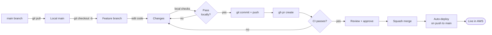

# 03 — Making Changes

How to take a change from idea to deployed AWS resource. The standard flow.

## Workflow at a glance



## Step 1 — Always start from a fresh main

```bash
git checkout main
git pull origin main
```

Skipping this step is the #1 cause of merge conflicts and CI failures. Always pull main before starting new work.

## Step 2 — Create a feature branch

```bash
git checkout -b feat/short-description
# or fix/, chore/, docs/, refactor/
```

Naming convention:

| Prefix | When to use |
|---|---|
| `feat/` | New functionality (new OU, new permission set, new pipeline stage) |
| `fix/` | Bug fix (broken workflow, malformed SCP) |
| `chore/` | Maintenance, dependency bumps, cleanup |
| `docs/` | Documentation-only changes |
| `refactor/` | Restructure code without behavior change |

## Step 3 — Make the change

Most changes will fall into one of these patterns:

### Pattern A — Add or modify an OU

Edit `infiquetra_aws_infra/organization_stack.py`. Use `organizations.CfnOrganizationalUnit` for OUs and `organizations.CfnPolicy` for SCPs. Reference [`../ops/01-aws-organization.md`](../ops/01-aws-organization.md) for what already exists.

### Pattern B — Add or modify an SSO permission set

Edit `infiquetra_aws_infra/sso_stack.py`. Use `sso.CfnPermissionSet`. Choose the right session duration tier (PT4H for admin, PT8H for developer, PT12H for billing — see [`../ops/02-identity-and-access.md`](../ops/02-identity-and-access.md)).

### Pattern C — Modify the CI/CD pipeline

Most workflow changes go in `.github/workflows/`. The pattern is:

- Main workflows (`pull-request-validation.yml`, `deploy-infrastructure.yml`) — orchestration
- Reusable workflows (`reusable-*.yml`) — actual work
- Composite actions (`.github/actions/*/action.yml`) — shared setup steps

When editing reusable workflows, remember the caller-permissions rule (see [LEARNINGS](../learnings/LEARNINGS.md)).

### Pattern D — Modify the GitHub OIDC role

Edit `github-oidc-bootstrap/github_oidc_bootstrap/github_oidc_bootstrap_stack.py`. **This is a separate CDK app** — deploy from inside `github-oidc-bootstrap/`:

```bash
cd github-oidc-bootstrap
uv run cdk deploy --profile infiquetra-root
```

Not part of the regular CI flow.

## Step 4 — Local validation

Before pushing, run what CI runs:

```bash
uv run ruff check .
uv run ruff format .
uv run mypy .
uv run cdk synth --all --quiet --profile infiquetra-root
```

Or all at once:

```bash
uv run pre-commit run --all-files
```

If `cdk synth` fails, your CDK code has a Python or CDK-API error. If it passes but you want to see _what_ would change in AWS:

```bash
uv run cdk diff --all --profile infiquetra-root
```

This compares your local CDK output with what's currently deployed.

## Step 5 — Commit

```bash
git add path/to/changed/files
git commit -m "feat(scope): short imperative description

Optional longer body explaining the why. Wrap at ~72 chars.

Reference any related issue: closes #N"
```

Commit message convention:

```
type(scope): short imperative description

[optional body]

[optional footer]
```

Types: `feat`, `fix`, `chore`, `docs`, `refactor`, `revert`.

`★ Don't:` Use `WIP:` or `tmp:` commits that you'll have to squash later. Squash-merge handles that for you on PRs.

## Step 6 — Push and open a PR

```bash
git push -u origin feat/your-branch

gh pr create --fill
# or with a custom body:
gh pr create --title "Title" --body "$(cat <<'EOF'
## Summary
- What changed
- Why

## Test plan
- [x] Local cdk synth passes
- [ ] CI validation passes
EOF
)"
```

## Step 7 — Watch the validation pipeline

```bash
# Live-watch checks
gh pr checks <PR_NUMBER> --watch --interval 20

# Get the run URL
gh pr view <PR_NUMBER> --json statusCheckRollup
```

Four checks will run: code-quality, security-scan, cdk-synthesis, validation-summary. All four must pass before merging.

If any fails, drill in:

```bash
gh run view <RUN_ID> --log-failed
```

## Step 8 — Merge

Once CI is green and you have a review approval:

```bash
gh pr merge <PR_NUMBER> --squash --delete-branch

# Admin override (current solo-dev workflow until team grows)
gh pr merge <PR_NUMBER> --admin --squash --delete-branch
```

Squash merge is preferred for small PRs (<5 commits). Use a regular merge for multi-commit feature work where the individual commits are meaningful.

## Step 9 — Auto-deploy

Merging to `main` triggers `.github/workflows/deploy-infrastructure.yml`, which:

1. Runs `uv run cdk deploy InfiquetraOrganizationStack`
2. Then `uv run cdk deploy InfiquetraSSOStack`
3. Pushes a deployment tag like `deploy-20260427-160000-<sha>`

Watch it:

```bash
# Find the run that just started
gh run list --workflow="Deploy Infrastructure" --limit 1

# Watch
gh run watch <RUN_ID> --exit-status
```

Typical no-op (no resource changes) deploy takes ~2 minutes. Real changes take longer depending on what's being created.

## What "ship a change" looks like end-to-end

```bash
# Start clean
git checkout main && git pull origin main

# Branch
git checkout -b feat/add-readonly-permission-set

# Edit
$EDITOR infiquetra_aws_infra/sso_stack.py
# (add a new sso.CfnPermissionSet)

# Validate locally
uv run ruff format . && uv run ruff check . && uv run mypy . && \
  uv run cdk synth --all --quiet --profile infiquetra-root

# Commit + push
git add infiquetra_aws_infra/sso_stack.py
git commit -m "feat(sso): add MarketingReader permission set"
git push -u origin feat/add-readonly-permission-set

# PR
gh pr create --fill

# Watch CI
gh pr checks --watch

# Merge once green
gh pr merge --admin --squash --delete-branch

# Deploy is automatic; verify
gh run list --workflow="Deploy Infrastructure" --limit 1
gh run watch <RUN_ID> --exit-status

# Confirm in AWS
aws sso-admin list-permission-sets \
  --instance-arn arn:aws:sso:::instance/ssoins-7223f05fc9da6e24 \
  --profile infiquetra-root
```

Total time for a simple change: 10-15 minutes.

## What if I just want to test locally without deploying?

```bash
# Synthesize and inspect the generated CFN
uv run cdk synth --all > /tmp/cdk-output.yaml --profile infiquetra-root
less /tmp/cdk-output.yaml

# See what would change vs. live AWS
uv run cdk diff --all --profile infiquetra-root

# Run the PR validation pipeline locally with `act`
brew install act
act pull_request -W .github/workflows/pull-request-validation.yml
```

`cdk synth` and `cdk diff` are read-only and require no AWS write access. Useful for sanity-checking before PR.

## Reverting a change

If a deployed change breaks production:

```bash
# 1. Revert the merge commit on main
git checkout main && git pull origin main
git revert <bad-commit-sha>
git push origin main
# This triggers a new deploy that undoes the change.

# 2. Alternative: re-deploy a known-good prior commit via tag
gh workflow run "Deploy Infrastructure" \
  --ref deploy-20260425-145556-f93e38e \
  -f environment=production -f stack=all
```

For more drastic recovery (e.g., a stack stuck in `ROLLBACK_COMPLETE`), see [`04-troubleshooting.md`](04-troubleshooting.md).
