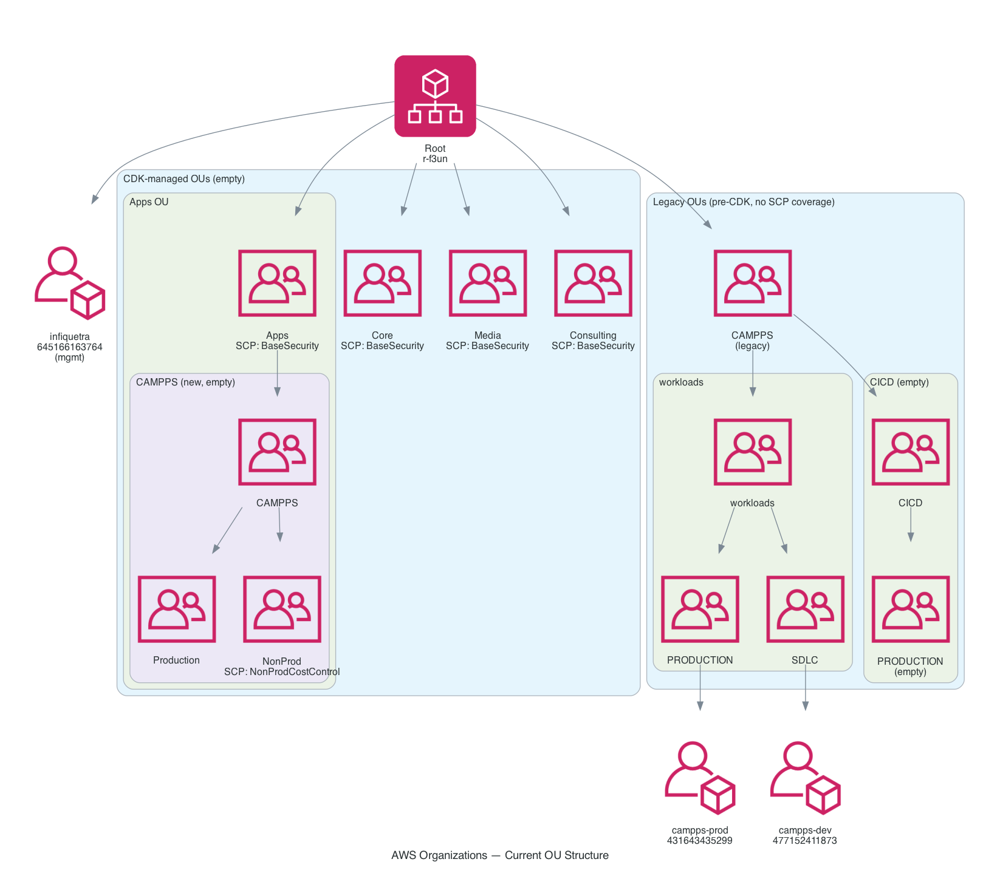

# 01 — AWS Organization

The complete picture of what's in AWS Organizations: accounts, OUs, the dual-CAMPPS situation, and what CDK is responsible for vs. what was pre-existing.

## Top-level facts

| Field | Value |
|---|---|
| Organization root ID | `r-f3un` |
| Organization owner / mgmt account | `645166163764` (infiquetra) |
| Owner email | `jeff@infiquetra.com` |
| Active accounts | 3 |
| OUs | 13 (5 CDK-managed, 8 legacy) |
| Customer-managed SCPs | 2 (BaseSecurityPolicy, NonProductionCostControl) |
| Region for global services | `us-east-1` |
| Enabled policy types at root | `SERVICE_CONTROL_POLICY` (enabled 2026-04-25, see [LEARNINGS](../learnings/LEARNINGS.md)) |

## Visual: full OU tree



## Tree (text version)

```
Root [r-f3un]
├── infiquetra            [645166163764]   mgmt account, jeff@infiquetra.com
│
├── Core                  [ou-f3un-772uqvdc]   ← CDK-managed, empty
├── Media                 [ou-f3un-8hynekjx]   ← CDK-managed, empty
├── Consulting            [ou-f3un-esi8ublq]   ← CDK-managed, empty
├── Apps                  [ou-f3un-srsbk9oh]   ← CDK-managed
│   └── CAMPPS            [ou-f3un-pb5ixa96]   ← CDK-managed, empty (the "new" CAMPPS)
│       ├── Production    [ou-f3un-cec60ji6]   ← CDK-managed, empty
│       └── NonProd       [ou-f3un-yb8hu7vq]   ← CDK-managed, empty
│
└── CAMPPS                [ou-f3un-s13dqexp]   ← LEGACY, pre-CDK (the "old" CAMPPS)
    ├── workloads         [ou-f3un-bhg44nrb]
    │   ├── PRODUCTION    [ou-f3un-ad24hdlv]
    │   │   └── campps-prod  [431643435299]
    │   └── SDLC          [ou-f3un-egwd0huq]
    │       └── campps-dev   [477152411873]
    └── CICD              [ou-f3un-ewwb2txi]   ← legacy, leftover from suspended campps-cicd
        └── PRODUCTION    [ou-f3un-cfcpbryc]   ← empty
```

## Accounts

| Account ID | Name | Email | Status | Lives in |
|---|---|---|---|---|
| `645166163764` | infiquetra | jeff@infiquetra.com | ACTIVE | Root (mgmt accounts don't go in OUs) |
| `431643435299` | campps-prod | _unset shown_ | ACTIVE | `CAMPPS / workloads / PRODUCTION` (legacy) |
| `477152411873` | campps-dev | _unset shown_ | ACTIVE | `CAMPPS / workloads / SDLC` (legacy) |

**Note**: `campps-cicd` (`424272146308`) was the originally-suspended account flagged in `.claude/audit-current-state.md` (2025-07-13). It is no longer in the org as of this snapshot — closed or removed at some point. The empty `CICD/PRODUCTION` OU is the only remaining trace.

## What CDK manages — `OrganizationStack`

CDK code at `infiquetra_aws_infra/organization_stack.py` produces these resources via the `InfiquetraOrganizationStack` CFN stack:

| Resource | CDK ID | Live AWS ID |
|---|---|---|
| OU | `CoreOU` | `ou-f3un-772uqvdc` |
| OU | `MediaOU` | `ou-f3un-8hynekjx` |
| OU | `ConsultingOU` | `ou-f3un-esi8ublq` |
| OU | `AppsOU` | `ou-f3un-srsbk9oh` |
| OU | `AppsCamppsOU` | `ou-f3un-pb5ixa96` |
| OU | `CamppsProductionOU` | `ou-f3un-cec60ji6` |
| OU | `CamppsNonProdOU` | `ou-f3un-yb8hu7vq` |
| SCP | `BaseSecuritySCP` | `p-oop3272h` (BaseSecurityPolicy) |
| SCP | `NonProdCostControlSCP` | `p-caqfo4ef` (NonProductionCostControl) |

**10 resources total** in `InfiquetraOrganizationStack` (including a CDK metadata resource).

**Stack state** (as of snapshot): `CREATE_COMPLETE`, last updated `2026-04-25T14:54:48Z`.

## What CDK does NOT manage

These exist in AWS but live outside the CDK stack — changes to them won't show up in `cdk diff`:

| Resource | Why CDK doesn't manage it |
|---|---|
| Legacy `CAMPPS` OU and its children (`workloads/PRODUCTION`, `workloads/SDLC`, `CICD`, `CICD/PRODUCTION`) | Created manually before this CDK existed |
| `campps-prod` and `campps-dev` accounts | Account creation requires `organizations:CreateAccount` and is typically not in IaC — even if it were, importing existing accounts into CDK is risky |
| `infiquetra` mgmt account | Mgmt accounts in AWS Organizations cannot be moved into OUs and are not modeled in CDK |
| Organization itself (`r-f3un`) | Created when AWS Organizations was first turned on for this account |
| `SERVICE_CONTROL_POLICY` enablement at the root | Imperative one-time AWS-side step; no CFN equivalent. See [LEARNINGS](../learnings/LEARNINGS.md). |

## The dual-CAMPPS situation explained

Two OUs both named "CAMPPS" coexist at different positions in the tree:

| | Legacy CAMPPS | New CAMPPS |
|---|---|---|
| ID | `ou-f3un-s13dqexp` | `ou-f3un-pb5ixa96` |
| Parent | Root | Apps OU |
| Contents | The actual workload accounts (`campps-prod`, `campps-dev`) inside its `workloads` sub-tree | Empty scaffolding (`Production`, `NonProd` sub-OUs, both empty) |
| Created by | Manual / pre-CDK | CDK (`OrganizationStack`) |
| SCPs attached | None | `NonProductionCostControl` (on the inner `NonProd` only) |

**Why this is OK**: AWS Organizations allows duplicate OU names at different parents. The two OUs are distinct resources. There is no conflict, no API error, just a naming collision in the tree. The state is intentional — see [DECISIONS](../learnings/DECISIONS.md) for the rationale on additive deploy.

**How it ends**: A future migration (P1 in [QUEUED](../learnings/QUEUED.md)) moves `campps-prod` and `campps-dev` from `CAMPPS/workloads/{PRODUCTION,SDLC}` into `Apps/CAMPPS/{Production,NonProd}`. Then the legacy `CAMPPS` OU and its children get deleted (`DeleteOrganizationalUnit` only works on empty OUs, in dependency order).

## Deploying changes

The OU tree is created/updated by:

```bash
# Manual deploy (debugging)
uv run cdk deploy InfiquetraOrganizationStack --profile infiquetra-root

# Via CI on push to main
git push origin main
# → triggers .github/workflows/deploy-infrastructure.yml
# → which calls reusable-aws-deployment.yml
# → which runs `uv run cdk deploy` for both stacks in order
```

`SSOStack` depends on `OrganizationStack`. Always deploy organization first.

## Recovery / drift detection

If state drifts (e.g., a manually created OU appears, an SCP attachment is removed in console):

```bash
# Check live state vs. CDK
uv run cdk diff InfiquetraOrganizationStack --profile infiquetra-root

# Re-pull live OU tree
aws organizations list-organizational-units-for-parent \
  --parent-id r-f3un --profile infiquetra-root

# List SCP attachments per policy
aws organizations list-targets-for-policy \
  --policy-id p-oop3272h --profile infiquetra-root
```
