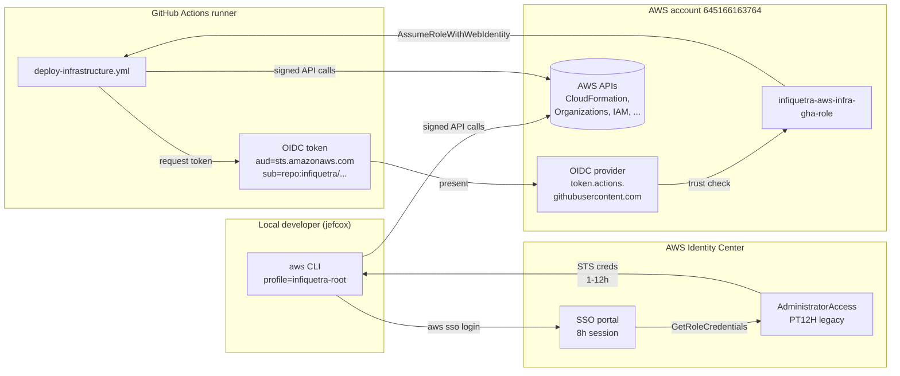

# 02 — Identity & Access

Who can log in, with what permissions, and how those permissions are wired together.

## Top-level facts

| Field | Value |
|---|---|
| Identity Center instance | `arn:aws:sso:::instance/ssoins-7223f05fc9da6e24` |
| Identity store ID | `d-90676975b4` |
| SSO portal URL | `https://d-90676975b4.awsapps.com/start` |
| Identity source | AWS-managed Identity Store (not federated to external IdP) |
| Users | 1 (`jefcox`) |
| Groups | 1 (`Administrators`, no members shown via API) |
| Permission sets | 13 (2 legacy AWS-default + 11 CDK-managed) |
| Account assignments | 6 (all to `jefcox` directly) |

## Users

| User | Display Name | User ID |
|---|---|---|
| `jefcox` | Jeffrey Cox | `90676975b4-c8e7f90d-ea45-4f5e-9715-bb483f59c11c` |

## Groups

| Group | Members |
|---|---|
| `Administrators` | 0 (group exists but is empty per `list-group-memberships`) |

## Permission sets — the full table

Two layers exist: **legacy** sets created when SSO was first turned on (2021), and **CDK-managed** sets created by `SSOStack` (deployed 2026-04-25).

### Legacy (NOT in CDK code — managed manually)

| Name | Session | Managed Policies | Notes |
|---|---|---|---|
| `AdministratorAccess` | `PT12H` | `AdministratorAccess`, `Billing`, `AWSBillingConductorFullAccess`, `AWSBillingReadOnlyAccess` | Bumped from PT1H → PT12H on 2026-04-25 (CLI). What `jefcox` actually uses today. |
| `Billing` | `PT12H` | `Billing` | Pre-existing parallel to BillingManager |

### CDK-managed (in `infiquetra_aws_infra/sso_stack.py`)

| Name | Session | Managed Policies | Description |
|---|---|---|---|
| `CoreAdministrator` | `PT4H` | `AdministratorAccess` | Admin access for Core OU (shared services) |
| `SecurityAuditor` | `PT8H` | `ReadOnlyAccess`, `SecurityAudit` | Read-only audit role |
| `BillingManager` | `PT12H` | `Billing` | Finance / billing operators |
| `MediaDeveloper` | `PT8H` | `PowerUserAccess` | Developer access for Media business unit |
| `MediaAdministrator` | `PT4H` | `AdministratorAccess` | Admin access for Media |
| `AppsDeveloper` | `PT8H` | `PowerUserAccess` | Developer access for Apps |
| `AppsAdministrator` | `PT4H` | `AdministratorAccess` | Admin access for Apps |
| `CamppssDeveloper` | `PT8H` | `PowerUserAccess` | Developer access for CAMPPS workloads |
| `ConsultingDeveloper` | `PT8H` | `PowerUserAccess` | Developer access for Consulting |
| `ConsultingAdministrator` | `PT4H` | `AdministratorAccess` | Admin access for Consulting |
| `ReadOnlyAccess` | `PT4H` | `ReadOnlyAccess` | Generic read-only |

`★ Tier convention:`

- **Administrator** sets get `PT4H` — short session for high-privilege roles
- **Developer** sets get `PT8H` — full work-day session
- **Billing** sets get `PT12H` — long session for periodic financial reporting work
- **Audit** sets get `PT8H` — work-day for read-only forensics

The legacy `AdministratorAccess` was bumped to PT12H (out-of-band) for debugging convenience. The CDK-managed admin sets are still PT4H — see `Maybe` item in [QUEUED](../learnings/QUEUED.md) about bumping `CoreAdministrator` to match.

## Who has what access right now

Six SSO account assignments — all on `jefcox` directly (no group-based assignments).

| Account | Permission Set | Principal |
|---|---|---|
| `infiquetra` (mgmt) | `AdministratorAccess` (legacy) | USER `jefcox` |
| `infiquetra` (mgmt) | `Billing` (legacy) | USER `jefcox` |
| `campps-prod` | `AdministratorAccess` (legacy) | USER `jefcox` |
| `campps-prod` | `Billing` (legacy) | USER `jefcox` |
| `campps-dev` | `AdministratorAccess` (legacy) | USER `jefcox` |
| `campps-dev` | `Billing` (legacy) | USER `jefcox` |

**Important**: None of the **CDK-managed** permission sets have any account assignments yet. They exist as definitions in Identity Center but no human is using them. Migrating off the legacy `AdministratorAccess` requires (a) assigning `jefcox` (or the `Administrators` group) to `CoreAdministrator` on each account, (b) verifying access works, (c) removing the legacy assignments.

## CI/CD identity — the GitHub OIDC role

This is a separate IAM-level identity (not an SSO permission set) used by GitHub Actions to deploy.

| Field | Value |
|---|---|
| Role name | `infiquetra-aws-infra-gha-role` |
| Role ARN | `arn:aws:iam::645166163764:role/infiquetra-aws-infra-gha-role` |
| Created | 2025-09-18 |
| Max session duration | 12h (`MaxSessionDuration: 43200s`) |
| Trust principal | `arn:aws:iam::645166163764:oidc-provider/token.actions.githubusercontent.com` |
| Trust action | `sts:AssumeRoleWithWebIdentity` |
| Trust audience claim | `sts.amazonaws.com` (default for `aws-actions/configure-aws-credentials`) |
| Trust subject claim | `repo:infiquetra/*` (StringLike) |
| OIDC provider | `arn:aws:iam::645166163764:oidc-provider/token.actions.githubusercontent.com` |

### Trust policy (live)

```json
{
  "Version": "2012-10-17",
  "Statement": [{
    "Effect": "Allow",
    "Principal": {"Federated": "arn:aws:iam::645166163764:oidc-provider/token.actions.githubusercontent.com"},
    "Action": "sts:AssumeRoleWithWebIdentity",
    "Condition": {
      "StringEquals": {"token.actions.githubusercontent.com:aud": "sts.amazonaws.com"},
      "StringLike": {"token.actions.githubusercontent.com:sub": "repo:infiquetra/*"}
    }
  }]
}
```

`⚠ Security observation:` The `sub` condition is `repo:infiquetra/*` — meaning **any GitHub repo in the `infiquetra` org can assume this role**, not just `infiquetra/infiquetra-aws-infra`. Tighter scoping (e.g., `repo:infiquetra/infiquetra-aws-infra:ref:refs/heads/main`) would limit lateral movement if another repo in the org is compromised. Tracked as a candidate for the security backlog.

### Attached managed policies (7)

These are customer-managed IAM policies, not AWS-managed:

| Policy | Purpose |
|---|---|
| `infiquetra-aws-infra-gha-cdk-policy` | CDK bootstrap + asset upload |
| `infiquetra-aws-infra-gha-infrastructure-policy` | Core IaC operations (CFN, IAM, Organizations) |
| `infiquetra-aws-infra-gha-security-policy` | KMS, Secrets Manager, ACM |
| `infiquetra-aws-infra-gha-data-analytics-policy` | Data services scope |
| `infiquetra-aws-infra-gha-event-driven-policy` | EventBridge, SNS, SQS scope |
| `infiquetra-aws-infra-gha-serverless-policy` | Lambda, API Gateway scope |
| `infiquetra-aws-infra-gha-edge-services-policy` | CloudFront, Route 53, WAF |

These are created by the **`infiquetra-aws-infra-gha-bootstrap`** CFN stack, which is a **separate one-time CDK app** at `github-oidc-bootstrap/`. The bootstrap stack provisioned the OIDC provider, the GHA role, and the 7 managed policies. It is not redeployed in the normal CI/CD flow — only re-run when the role's permission scope needs to change.

## How identities flow into AWS API calls



## Reference: how to inspect live identity state

```bash
# All permission sets with session durations
INSTANCE=arn:aws:sso:::instance/ssoins-7223f05fc9da6e24
aws sso-admin list-permission-sets --instance-arn "$INSTANCE" --profile infiquetra-root \
  | jq -r '.PermissionSets[]' \
  | xargs -I{} aws sso-admin describe-permission-set \
      --instance-arn "$INSTANCE" --permission-set-arn {} --profile infiquetra-root \
      --query 'PermissionSet.{Name:Name,Session:SessionDuration}' --output table

# Assignments for a specific permission set on a specific account
aws sso-admin list-account-assignments \
  --instance-arn "$INSTANCE" \
  --account-id 645166163764 \
  --permission-set-arn arn:aws:sso:::permissionSet/ssoins-7223f05fc9da6e24/ps-4908f02414180aa1 \
  --profile infiquetra-root

# GHA role trust policy
aws iam get-role --role-name infiquetra-aws-infra-gha-role \
  --profile infiquetra-root --query 'Role.AssumeRolePolicyDocument'
```
