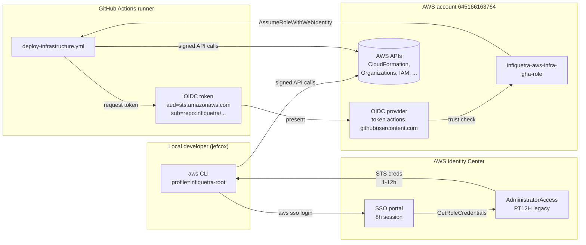

# 02 — Identity & Access

Who can log in, with what permissions, and how those permissions are wired together.

## Top-level facts

| Field | Value |
|---|---|
| Identity Center instance | `arn:aws:sso:::instance/ssoins-7223f05fc9da6e24` |
| Identity store ID | `d-90676975b4` |
| SSO portal URL | `https://d-90676975b4.awsapps.com/start` |
| Identity source | AWS-managed Identity Store (not federated to external IdP) |
| Users | 1 (`jefcox`) |
| Groups | 1 (`Administrators`, no members shown via API) |
| Permission sets | Live audit: 13 (2 legacy AWS-default + 11 CDK-managed); CDK target: 14 (2 legacy + 12 CDK-managed) |
| Account assignments | Live audit: 6 direct legacy assignments; CDK target adds 4 optional group assignments when group IDs are supplied |

> **Status note (2026-05-06):** The live audit values above describe what was observed in AWS before this foundation update. The source now defines the target Identity Center assignments and workload deploy roles, but deployment still needs an explicit preflight and approval.

## Users

| User | Display Name | User ID |
|---|---|---|
| `jefcox` | Jeffrey Cox | `90676975b4-c8e7f90d-ea45-4f5e-9715-bb483f59c11c` |

## Groups

| Group | Members |
|---|---|
| `Administrators` | 0 (group exists but is empty per `list-group-memberships`) |

## Permission sets — the full table

Two layers exist: **legacy** sets created when SSO was first turned on (2021), and **CDK-managed** sets created by `SSOStack` (deployed 2026-04-25).

### Legacy (NOT in CDK code — managed manually)

| Name | Session | Managed Policies | Notes |
|---|---|---|---|
| `AdministratorAccess` | `PT12H` | `AdministratorAccess`, `Billing`, `AWSBillingConductorFullAccess`, `AWSBillingReadOnlyAccess` | Bumped from PT1H → PT12H on 2026-04-25 (CLI). What `jefcox` actually uses today. |
| `Billing` | `PT12H` | `Billing` | Pre-existing parallel to BillingManager |

### CDK-managed (in `infiquetra_aws_infra/sso_stack.py`)

| Name | Session | Managed Policies | Description |
|---|---|---|---|
| `CoreAdministrator` | `PT4H` | `AdministratorAccess` | Admin access for Core OU (shared services) |
| `SecurityAuditor` | `PT8H` | `ReadOnlyAccess`, `SecurityAudit` | Read-only audit role |
| `BillingManager` | `PT12H` | `Billing` | Finance / billing operators |
| `MediaDeveloper` | `PT8H` | `PowerUserAccess` | Developer access for Media business unit |
| `MediaAdministrator` | `PT4H` | `AdministratorAccess` | Admin access for Media |
| `AppsDeveloper` | `PT8H` | `PowerUserAccess` | Developer access for Apps |
| `AppsAdministrator` | `PT4H` | `AdministratorAccess` | Admin access for Apps |
| `CAMPPSDeveloper` | `PT8H` | `PowerUserAccess` + CAMPPS inline policy | Developer access for CAMPPS nonprod workloads |
| `CAMPPSProductionBreakGlassAdministrator` | `PT4H` | `AdministratorAccess` | Emergency administrator access for CAMPPS production workloads |
| `ConsultingDeveloper` | `PT8H` | `PowerUserAccess` | Developer access for Consulting |
| `ConsultingAdministrator` | `PT4H` | `AdministratorAccess` | Admin access for Consulting |
| `ReadOnlyAccess` | `PT4H` | `ReadOnlyAccess` | Generic read-only |

`★ Tier convention:`

- **Administrator** sets get `PT4H` — short session for high-privilege roles
- **Developer** sets get `PT8H` — full work-day session
- **Billing** sets get `PT12H` — long session for periodic financial reporting work
- **Audit** sets get `PT8H` — work-day for read-only forensics

The legacy `AdministratorAccess` was bumped to PT12H (out-of-band) for debugging convenience. The CDK-managed admin sets are still PT4H — see `Maybe` item in [QUEUED](../engineering-journal/QUEUED.md) about bumping `CoreAdministrator` to match.

## Who has what access right now

Six SSO account assignments — all on `jefcox` directly (no group-based assignments).

| Account | Permission Set | Principal |
|---|---|---|
| `infiquetra` (mgmt) | `AdministratorAccess` (legacy) | USER `jefcox` |
| `infiquetra` (mgmt) | `Billing` (legacy) | USER `jefcox` |
| `campps-prod` | `AdministratorAccess` (legacy) | USER `jefcox` |
| `campps-prod` | `Billing` (legacy) | USER `jefcox` |
| `campps-dev` | `AdministratorAccess` (legacy) | USER `jefcox` |
| `campps-dev` | `Billing` (legacy) | USER `jefcox` |

**Important**: The six rows above are live legacy assignments from the last audit. The CDK target now supports group-based assignments, but those assignments are conditional and only materialize when the deployment supplies non-empty group IDs.

## CDK target human-access model

`infiquetra_aws_infra/sso_stack.py` now defines four optional group assignment parameters. Empty defaults keep deployments safe while the real Identity Center group IDs are created or verified.

| Parameter | Permission set | Target account | Purpose |
|---|---|---|---|
| `InfiquetraAdminsGroupId` | `CoreAdministrator` | `645166163764` management | Manage organization, SSO, and foundation stacks |
| `CamppsDevelopersGroupId` | `CAMPPSDeveloper` | `477152411873` campps-dev | Day-to-day nonprod development and debugging |
| `CamppsProdReadOnlyGroupId` | `ReadOnlyAccess` | `431643435299` campps-prod | Production inspection without write access |
| `CamppsProdBreakGlassAdminsGroupId` | `CAMPPSProductionBreakGlassAdministrator` | `431643435299` campps-prod | Emergency production changes only |

The intended migration path is: create or verify the groups, deploy these parameters, test each profile, then remove the direct legacy `AdministratorAccess` assignments. Do not remove the legacy assignments first.

## CI/CD identity — GitHub OIDC roles

This is a separate IAM-level identity (not an SSO permission set) used by GitHub Actions to deploy.

| Field | Value |
|---|---|
| Role name | `infiquetra-aws-infra-gha-role` |
| Role ARN | `arn:aws:iam::645166163764:role/infiquetra-aws-infra-gha-role` |
| Created | 2025-09-18 |
| Max session duration | 12h (`MaxSessionDuration: 43200s`) |
| Trust principal | `arn:aws:iam::645166163764:oidc-provider/token.actions.githubusercontent.com` |
| Trust action | `sts:AssumeRoleWithWebIdentity` |
| Trust audience claim | `sts.amazonaws.com` (default for `aws-actions/configure-aws-credentials`) |
| Trust subject claim | CDK target: `repo:infiquetra/infiquetra-aws-infra:ref:refs/heads/main` (StringEquals) |
| OIDC provider | `arn:aws:iam::645166163764:oidc-provider/token.actions.githubusercontent.com` |

### Management trust policy target

```json
{
  "Version": "2012-10-17",
  "Statement": [{
    "Effect": "Allow",
    "Principal": {"Federated": "arn:aws:iam::645166163764:oidc-provider/token.actions.githubusercontent.com"},
    "Action": "sts:AssumeRoleWithWebIdentity",
    "Condition": {
      "StringEquals": {
        "token.actions.githubusercontent.com:aud": "sts.amazonaws.com",
        "token.actions.githubusercontent.com:sub": "repo:infiquetra/infiquetra-aws-infra:ref:refs/heads/main"
      }
    }
  }]
}
```

This role is for the foundation repository only. CAMPPS service repositories must not reuse it.

### Attached managed policy target

The bootstrap app now attaches one customer-managed policy to the management deploy role:

| Policy | Purpose |
|---|---|
| `infiquetra-aws-infra-gha-cdk-policy` | Scoped CDK deployment permissions for the foundation stacks and bootstrap stack |

The old broad workload policies were intentionally removed from the CDK target. Application repositories get separate workload-account roles instead.

### CAMPPS workload deploy roles

`app_campps_bootstrap.py` defines deploy-role stacks for the CAMPPS workload accounts:

| Stack | Account | GitHub environment | Role pattern |
|---|---|---|---|
| `CamppsNonProdDeployRolesStack` | `477152411873` campps-dev | `nonprod` | `campps-<service>-nonprod-gha-deploy-role` |
| `CamppsProductionDeployRolesStack` | `431643435299` campps-prod | `production` | `campps-<service>-production-gha-deploy-role` |

Each service is registered in `infiquetra_aws_infra/campps_service_registry.py`. The first registered service is `infiquetra/campps-tenant-setup-service`, which creates `campps-tenant-setup-<environment>-gha-deploy-role` and `campps-tenant-setup-<environment>-gha-deploy-policy`.

Trust is exact to the repository and GitHub environment:

```text
repo:infiquetra/<service-repo>:environment:<nonprod-or-production>
```

The workload deploy policy excludes management-plane services such as Organizations, SSO Admin, SSO, and IdentityStore. It is scoped to serverless app resources named with `campps-<service>-<environment>-*`, CDK asset buckets in the workload account, and app IAM roles/policies under `campps-<service>-<environment>-app-*`. App roles must be created with the per-service permissions boundary `campps-<service>-<environment>-permissions-boundary` before they can be passed to Lambda, API Gateway, EventBridge, or CloudFormation.

## How identities flow into AWS API calls



## Reference: how to inspect live identity state

```bash
# All permission sets with session durations
INSTANCE=arn:aws:sso:::instance/ssoins-7223f05fc9da6e24
aws sso-admin list-permission-sets --instance-arn "$INSTANCE" --profile infiquetra-root \
  | jq -r '.PermissionSets[]' \
  | xargs -I{} aws sso-admin describe-permission-set \
      --instance-arn "$INSTANCE" --permission-set-arn {} --profile infiquetra-root \
      --query 'PermissionSet.{Name:Name,Session:SessionDuration}' --output table

# Assignments for a specific permission set on a specific account
aws sso-admin list-account-assignments \
  --instance-arn "$INSTANCE" \
  --account-id 645166163764 \
  --permission-set-arn arn:aws:sso:::permissionSet/ssoins-7223f05fc9da6e24/ps-4908f02414180aa1 \
  --profile infiquetra-root

# GHA role trust policy
aws iam get-role --role-name infiquetra-aws-infra-gha-role \
  --profile infiquetra-root --query 'Role.AssumeRolePolicyDocument'
```
