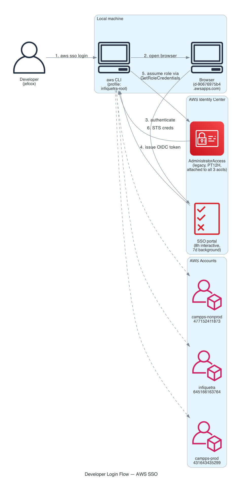
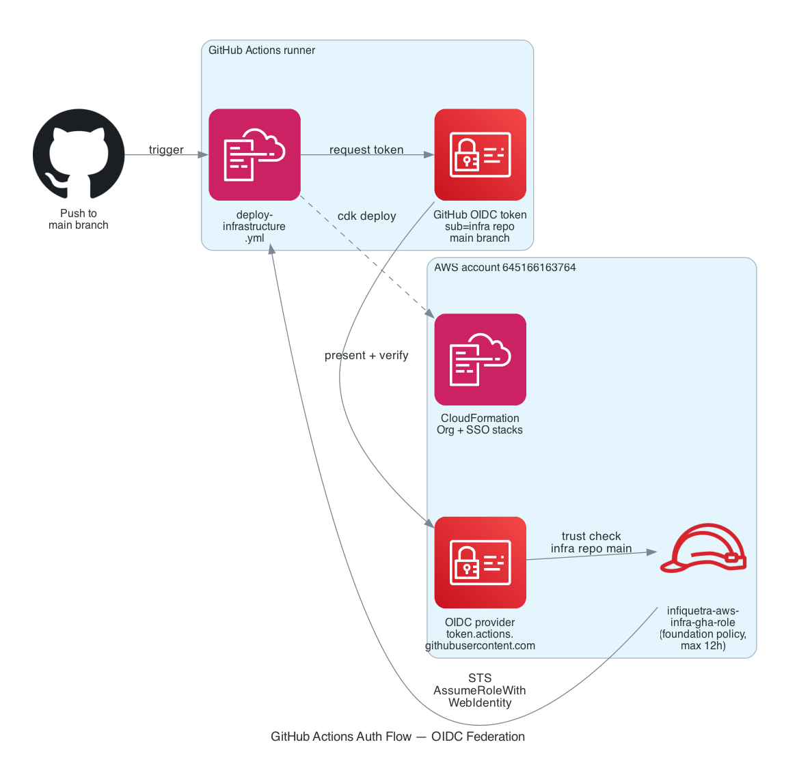

# 03 — Login Flows

How identities actually become AWS API calls — for humans and for CI/CD.

## Developer login (you, day-to-day)



### Step-by-step

```bash
aws sso login --profile infiquetra-root
```

1. The CLI reads `~/.aws/config` and finds the `[profile infiquetra-root]` SSO settings.
2. The CLI opens your default browser to `https://d-90676975b4.awsapps.com/start`.
3. You authenticate (Identity Store credentials + MFA if configured at the IdP level).
4. The portal returns an **OIDC access token** to the CLI, written to `~/.aws/sso/cache/<hash>.json` with `expiresAt` ~1h ahead.
5. On any subsequent AWS CLI call, the CLI uses that token to call `sso:GetRoleCredentials`, which returns short-lived STS credentials for whichever permission set you're using.
6. STS credentials are cached at `~/.aws/cli/cache/<hash>.json`. They auto-refresh as long as the OIDC access token is valid.

### Two TTLs you need to know

| TTL | Where set | Currently | Effect when expires |
|---|---|---|---|
| **OIDC access token** | Implicitly 1h, refreshes for the duration of the IAM IC session | 1h (rotates) | Cache file rewritten with new token; no user action |
| **IAM IC interactive session** | Identity Center → Settings → Authentication | **8h** | `aws sso login` required again |
| **IAM IC background session** | Same | **7d** | Refresh-token chain dies; `aws sso login` required |
| **Permission set session** | Per-permission-set `SessionDuration` | `AdministratorAccess` = `PT12H` | Role creds expire; auto-refreshed by CLI as long as IC session is still valid |

> The "1h" you see in `~/.aws/sso/cache/*.json` is the immediate access-token TTL, **not** the overall session length. The CLI rotates that token in the background; you're good for 8h before needing to log in again.

### Local AWS CLI config

```ini
# ~/.aws/config
[profile infiquetra-root]
sso_session = infiquetra
sso_account_id = 645166163764
sso_role_name = AdministratorAccess
region = us-east-1

[sso-session infiquetra]
sso_start_url = https://d-90676975b4.awsapps.com/start
sso_region = us-east-1
sso_registration_scopes = sso:account:access
```

If you don't have this set up yet, see [`../onboarding/01-getting-aws-access.md`](../onboarding/01-getting-aws-access.md).

### Switching permission sets / accounts

The profile above pins you to `AdministratorAccess` on `645166163764`. To use a different permission set or account, either:

```bash
# Use a one-off
AWS_PROFILE=infiquetra-root aws sts get-caller-identity

# Or define another profile in ~/.aws/config
[profile infiquetra-prod]
sso_session = infiquetra
sso_account_id = 431643435299
sso_role_name = AdministratorAccess
region = us-east-1
```

Both profiles share the `sso-session` block, so a single `aws sso login --sso-session infiquetra` covers all of them.

### MFA

Currently MFA is **enforced at the Identity Store level**, not by SCPs. Specifically:

- The `Administrators` group in Identity Center has MFA registered (FIDO/TOTP).
- The SCP `BaseSecurityPolicy` includes a `RequireMFAForSensitiveActions` statement that blocks IAM and Organizations writes without MFA — but only on principals in OUs that have the SCP attached. Currently those are the empty CDK-managed OUs (Core, Media, Apps, Consulting). The SCP does **not** apply to actions in the management account, since SCPs never apply to mgmt accounts. So `jefcox`'s MFA enforcement comes from the IdP layer, not from SCP.

## CI/CD login (GitHub Actions → AWS)



### Step-by-step

When the foundation workflow runs from `main` or `workflow_dispatch` on `main`:

1. Workflow step `aws-actions/configure-aws-credentials@v5` calls the GitHub-hosted OIDC issuer to **request a token** for this run.
2. GitHub returns a JWT signed by `token.actions.githubusercontent.com` with claims:
   - `aud: sts.amazonaws.com`
   - `sub: repo:infiquetra/infiquetra-aws-infra:ref:refs/heads/main`
   - `repository`, `actor`, `ref`, `run_id`, etc.
3. The action presents the JWT to AWS STS via `AssumeRoleWithWebIdentity` against `infiquetra-aws-infra-gha-role` in the management account.
4. STS validates the token signature against the OIDC provider's keys, then evaluates the role's trust policy. The management role's CDK target requires:
   - `aud == "sts.amazonaws.com"` ✓
   - `sub == "repo:infiquetra/infiquetra-aws-infra:ref:refs/heads/main"` ✓
5. STS returns short-lived credentials (default 1h, capped by role's `MaxSessionDuration` of 12h). The action exports them as env vars for the rest of the job.
6. Subsequent steps (`uv run cdk deploy`) use those credentials to call CloudFormation, Organizations, SSO Admin, IAM, and related foundation APIs.

### Why it's secret-less

There is **no AWS access key stored in GitHub** for this flow. The OIDC token is issued just-in-time per workflow run and is verified against AWS's local copy of the OIDC provider's signing keys. Compromising a GitHub secret cannot leak permanent AWS credentials.

### Where the trust policy lives

The trust policy is on the IAM role, deployed by the **bootstrap CDK app** at `github-oidc-bootstrap/`. To inspect:

```bash
aws iam get-role --role-name infiquetra-aws-infra-gha-role \
  --profile infiquetra-root \
  --query 'Role.AssumeRolePolicyDocument'
```

To **change** the trust policy:

1. Edit `github-oidc-bootstrap/github_oidc_bootstrap/github_oidc_stack.py`.
2. Deploy from `github-oidc-bootstrap/` directory: `uv run cdk deploy --profile infiquetra-root`.
3. This is a **manual, one-off deploy** — not part of the normal CI flow. The bootstrap stack is intentionally separate to avoid bootstrapping cycles (it provisions the role that CI uses to deploy).

### CAMPPS service repository OIDC target

CAMPPS service repositories do not use the management-account `infiquetra-aws-infra-gha-role`. Their CDK target is a per-service deploy role in the workload account:

| Environment | Account | Subject claim |
|---|---|---|
| `nonprod` | `477152411873` campps-dev | `repo:infiquetra/<service-repo>:environment:nonprod` |
| `production` | `431643435299` campps-prod | `repo:infiquetra/<service-repo>:environment:production` |

The first registered service is `infiquetra/campps-tenant-setup-service`, which gets `campps-tenant-setup-nonprod-gha-deploy-role` and `campps-tenant-setup-production-gha-deploy-role` when `app_campps_bootstrap.py` is deployed. Those workload roles exclude Organizations, SSO Admin, SSO, and IdentityStore permissions.

## Programmatic access to other accounts

If you need API access into `campps-prod` or `campps-dev` from your local CLI today:

```bash
# Current legacy profiles (uses the same sso-session)
cat >> ~/.aws/config <<'EOF'
[profile campps-prod-legacy-admin]
sso_session = infiquetra
sso_account_id = 431643435299
sso_role_name = AdministratorAccess
region = us-east-1

[profile campps-dev-legacy-admin]
sso_session = infiquetra
sso_account_id = 477152411873
sso_role_name = AdministratorAccess
region = us-east-1
EOF

# Use them
aws sts get-caller-identity --profile campps-prod-legacy-admin
aws sts get-caller-identity --profile campps-dev-legacy-admin
```

Those profiles reflect the live legacy assignments from the last audit. The CDK target is group based:

```ini
[profile campps-dev]
sso_session = infiquetra
sso_account_id = 477152411873
sso_role_name = CAMPPSDeveloper
region = us-east-1

[profile campps-prod-readonly]
sso_session = infiquetra
sso_account_id = 431643435299
sso_role_name = ReadOnlyAccess
region = us-east-1

[profile campps-prod-breakglass]
sso_session = infiquetra
sso_account_id = 431643435299
sso_role_name = CAMPPSProductionBreakGlassAdministrator
region = us-east-1
```

Do not remove the legacy `AdministratorAccess` assignments until the CDK target group assignments are deployed and these profiles have been tested. See [02-identity-and-access.md](02-identity-and-access.md) for the full assignment table and migration order.

## Common login issues

| Symptom | Cause | Fix |
|---|---|---|
| `Token has expired and refresh failed` | IAM IC interactive session (8h) expired | `aws sso login --profile infiquetra-root` |
| Browser opens then closes immediately | Old SSO cache; CLI thinks it's still logged in | `rm -rf ~/.aws/sso/cache && aws sso login --profile infiquetra-root` |
| `An error occurred (AccessDenied)` calling Org APIs | You're authenticated to the wrong account | Check `aws sts get-caller-identity --profile X`; org APIs only work on mgmt account |
| Workflow fails at `Configure AWS credentials` step | OIDC trust policy mismatch | For this repo, check the run is on `infiquetra/infiquetra-aws-infra` `main`; for service repos, check the GitHub environment matches `nonprod` or `production` |
| Workflow fails immediately with `startup_failure` | Caller workflow lacks `id-token: write` permission | See [LEARNINGS](../engineering-journal/LEARNINGS.md) entry on reusable workflow permissions |
