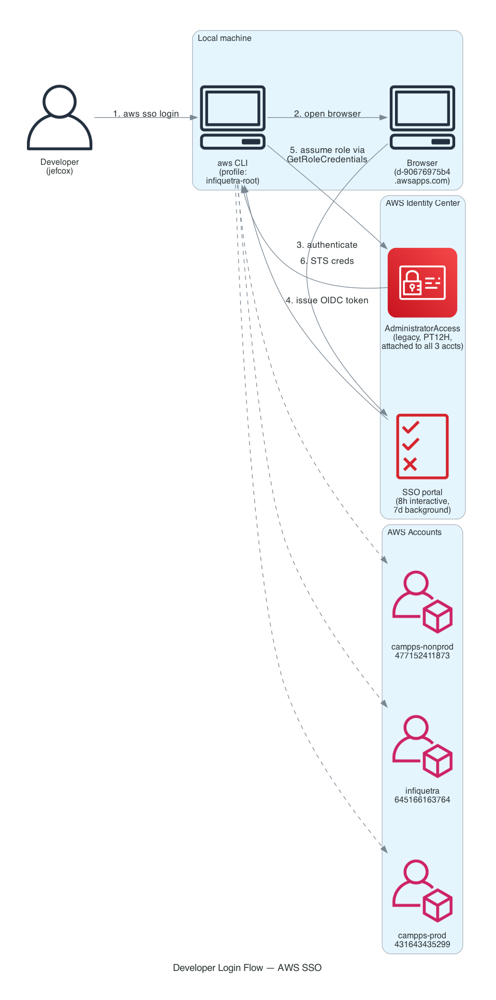
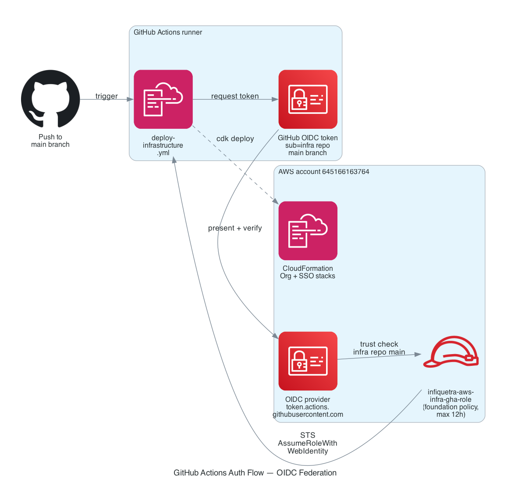

# 03 — Login Flows

How identities actually become AWS API calls — for humans and for CI/CD.

## Developer login (you, day-to-day)



### Step-by-step

```bash
aws sso login --profile infiquetra-root
```

1. The CLI reads `~/.aws/config` and finds the `[profile infiquetra-root]` SSO settings.
2. The CLI opens your default browser to `https://d-90676975b4.awsapps.com/start`.
3. You authenticate (Identity Store credentials + MFA if configured at the IdP level).
4. The portal returns an **OIDC access token** to the CLI, written to `~/.aws/sso/cache/<hash>.json` with `expiresAt` ~1h ahead.
5. On any subsequent AWS CLI call, the CLI uses that token to call `sso:GetRoleCredentials`, which returns short-lived STS credentials for whichever permission set you're using.
6. STS credentials are cached at `~/.aws/cli/cache/<hash>.json`. They auto-refresh as long as the OIDC access token is valid.

### Two TTLs you need to know

| TTL | Where set | Currently | Effect when expires |
|---|---|---|---|
| **OIDC access token** | Implicitly 1h, refreshes for the duration of the IAM IC session | 1h (rotates) | Cache file rewritten with new token; no user action |
| **IAM IC interactive session** | Identity Center → Settings → Authentication | **8h** | `aws sso login` required again |
| **IAM IC background session** | Same | **7d** | Refresh-token chain dies; `aws sso login` required |
| **Permission set session** | Per-permission-set `SessionDuration` | `AdministratorAccess` = `PT12H` | Role creds expire; auto-refreshed by CLI as long as IC session is still valid |

> The "1h" you see in `~/.aws/sso/cache/*.json` is the immediate access-token TTL, **not** the overall session length. The CLI rotates that token in the background; you're good for 8h before needing to log in again.

### Local AWS CLI config

```ini
# ~/.aws/config
[profile infiquetra-root]
sso_session = infiquetra
sso_account_id = 645166163764
sso_role_name = AdministratorAccess
region = us-east-1

[sso-session infiquetra]
sso_start_url = https://d-90676975b4.awsapps.com/start
sso_region = us-east-1
sso_registration_scopes = sso:account:access
```

If you don't have this set up yet, see [`../onboarding/01-getting-aws-access.md`](../onboarding/01-getting-aws-access.md).

### Switching permission sets / accounts

The profile above pins you to `AdministratorAccess` on `645166163764`. To use a different permission set or account, either:

```bash
# Use a one-off
AWS_PROFILE=infiquetra-root aws sts get-caller-identity

# Or define another profile in ~/.aws/config
[profile infiquetra-prod]
sso_session = infiquetra
sso_account_id = 431643435299
sso_role_name = AdministratorAccess
region = us-east-1
```

Both profiles share the `sso-session` block, so a single `aws sso login --sso-session infiquetra` covers all of them.

### MFA

Currently MFA is **enforced at the Identity Store level**, not by SCPs. Specifically:

- The `Administrators` group in Identity Center has MFA registered (FIDO/TOTP).
- The SCP `BaseSecurityPolicy` includes a `RequireMFAForSensitiveActions` statement that blocks IAM and Organizations writes without MFA — but only on principals in OUs that have the SCP attached. Currently those are the empty CDK-managed OUs (Core, Media, Apps, Consulting). The SCP does **not** apply to actions in the management account, since SCPs never apply to mgmt accounts. So `jefcox`'s MFA enforcement comes from the IdP layer, not from SCP.

## CI/CD login (GitHub Actions → AWS)



### Step-by-step

When the foundation workflow runs from `main` or `workflow_dispatch` on `main`:

1. Workflow step `aws-actions/configure-aws-credentials@v5` calls the GitHub-hosted OIDC issuer to **request a token** for this run.
2. GitHub returns a JWT signed by `token.actions.githubusercontent.com` with claims:
   - `aud: sts.amazonaws.com`
   - `sub: repo:infiquetra/infiquetra-aws-infra:ref:refs/heads/main`
   - `repository`, `actor`, `ref`, `run_id`, etc.
3. The action presents the JWT to AWS STS via `AssumeRoleWithWebIdentity` against `infiquetra-aws-infra-gha-role` in the management account.
4. STS validates the token signature against the OIDC provider's keys, then evaluates the role's trust policy. The management role's CDK target requires:
   - `aud == "sts.amazonaws.com"` ✓
   - `sub == "repo:infiquetra/infiquetra-aws-infra:ref:refs/heads/main"` ✓
5. STS returns short-lived credentials (default 1h, capped by role's `MaxSessionDuration` of 12h). The action exports them as env vars for the rest of the job.
6. Subsequent steps (`uv run cdk deploy`) use those credentials to call CloudFormation, Organizations, SSO Admin, IAM, and related foundation APIs.

### Why it's secret-less

There is **no AWS access key stored in GitHub** for this flow. The OIDC token is issued just-in-time per workflow run and is verified against AWS's local copy of the OIDC provider's signing keys. Compromising a GitHub secret cannot leak permanent AWS credentials.

### Where the trust policy lives

The trust policy is on the IAM role, deployed by the **bootstrap CDK app** at `github-oidc-bootstrap/`. To inspect:

```bash
aws iam get-role --role-name infiquetra-aws-infra-gha-role \
  --profile infiquetra-root \
  --query 'Role.AssumeRolePolicyDocument'
```

To **change** the trust policy:

1. Edit `github-oidc-bootstrap/github_oidc_bootstrap/github_oidc_stack.py`.
2. Deploy from `github-oidc-bootstrap/` directory: `uv run cdk deploy --profile infiquetra-root`.
3. This is a **manual, one-off deploy** — not part of the normal CI flow. The bootstrap stack is intentionally separate to avoid bootstrapping cycles (it provisions the role that CI uses to deploy).

### CAMPPS service repository OIDC target

CAMPPS service repositories do not use the management-account `infiquetra-aws-infra-gha-role`. Their CDK target is a per-service deploy role in the workload account:

| Environment | Account | Subject claim |
|---|---|---|
| `nonprod` | `477152411873` campps-nonprod | `repo:infiquetra/<service-repo>:environment:nonprod` |
| `production` | `431643435299` campps-prod | `repo:infiquetra/<service-repo>:environment:production` |

The active service registry covers existing service repositories: `infiquetra/campps-platform`, `infiquetra/campps-contracts`, and `infiquetra/campps-identity-access`. Each active service gets `campps-<service>-nonprod-gha-deploy-role` and `campps-<service>-production-gha-deploy-role` when `app_campps_bootstrap.py` is deployed. Those workload roles exclude Organizations, SSO Admin, SSO, and IdentityStore permissions.

### CAMPPS nonprod prerequisite-operator bootstrap (Tenant Setup #164)

The protected Canary workflow `Tenant Setup Prerequisites Nonprod` does **not**
use the ordinary live-proof role or a service deploy role. Nonprod
`CamppsDeployRolesStack` mints one extra role,
`campps-e2e-canary-nonprod-gha-prerequisite-operator-role`, reused against the
same GitHub OIDC provider. Maximum session is one hour. Trust is only
`sts:AssumeRoleWithWebIdentity` with exact `StringEquals` claims:

| Claim | Required value |
|---|---|
| `aud` | `sts.amazonaws.com` |
| `sub` | `repo:infiquetra/campps-e2e-canary:environment:nonprod` |
| `repository` | `infiquetra/campps-e2e-canary` |
| `environment` | `nonprod` |
| `ref` | `refs/heads/main` |
| `workflow` | `Tenant Setup Prerequisites Nonprod` (the signed workflow **name**, not a path) |

Missing or mismatched claims fail closed. There is no `StringEqualsIfExists`,
wildcard subject, actor allowlist, staging/production trust, or second persona.

The role may: mint a step-local CodeArtifact token on the existing `infiquetra`
domain (`sts:AWSServiceName=codeartifact.amazonaws.com`); read the locked
`infiquetra/campps` repository; read only the dedicated operator bundle selected
by `CAMPPS_TENANT_SETUP_OPERATOR_SECRET_ID` and the reviewed WorkOS API-key
secret; and assume the exact Tenant Setup fixture-ops and planned Identity
platform-operator roles in the same account. It has no table, EventBridge,
secret-write, PassRole, admin, or deploy permission. Ordinary live-proof and
deploy policies are unchanged.

Infra publishes one output, `CamppsE2eCanaryPrerequisiteOperatorRoleArn`.
Runtime binds `CAMPPS_PREREQUISITE_OPERATOR_ROLE_ARN` from that **deployed**
output after review — never from a predicted or synthesized ARN. Tenant Setup
and Identity own the later child-role outputs. Synth and diff this stack only
with:

```bash
uv run cdk synth --app "python3 app_campps_bootstrap.py" CamppsNonProdDeployRolesStack
uv run cdk diff --app "python3 app_campps_bootstrap.py" CamppsNonProdDeployRolesStack
```

Do not use the default organization app or `--all`. The GitHub
`Deploy Infrastructure` workflow still targets the organization app and must
not be used to apply this stack.

#### Selector ownership and pending release evidence

Architect disposition
[`6f5b609`](https://github.com/infiquetra/campps-tenant-setup/blob/6f5b6099692bb26b7bdd7053b840f0503d0716b4/docs/runs/164/continuation-review-disposition.md)
retains the two approved logical secret names and their six-character
AWS-generated ARN suffix selector `-??????`, scoped to the exact nonprod
account and `us-east-1`. The existing stack tests exercise the synthesized
`PrerequisiteOperatorSecretRead` resources: both intended names match;
retained/other names, copied or extended prefixes, nested paths, wrong suffix
lengths, accounts and regions do not. This is local selector evidence, not
live inventory or permission proof. Recreating the same logical name remains
selectable; the maintained setup owner must revalidate actual secret/configuration
ownership and the expected operator binding before use. This grants no permission
to recreate secrets or add speculative CMK decrypt authority.

The Canary owner maintains the exact signed workflow name and its uniqueness in
[`test_tenant_setup_prerequisite_workflow_contract.py`](https://github.com/infiquetra/campps-e2e-canary/blob/9e9582412e5f30ec70bee05340c304e8214323b3/tests/unit/test_tenant_setup_prerequisite_workflow_contract.py).
That maintained test rejects renamed or duplicate occurrences. Coordinate any
rename with the infra trust owner; all six exact claims remain required and a
mismatch denies assumption. No runtime name-discovery mechanism is needed.

B1 may precede the exact T2/I2 destination roles. A policy naming a future role
does not prove that the role exists or can be assumed. Runtime must reject
missing/wrong bindings and failed assumptions; Release reads the deployed
service outputs and effective trust before use, preserving the existing
B1-before-T2/I2 integration sequence.

**Pending evidence — Release/Tester nonprod binding readback:** record actual
nonprod environment protection, main restriction, signed OIDC claims,
bootstrap output/configuration equality, child-role output/configuration
equality and effective caller/target trust. YAML, synthesized ARNs and local
doubles are static evidence only. This is the existing preparation evidence
item, not a new operator gate or a requirement for production proof.

#### Owned cleanup and bootstrap removal

Normal per-run cleanup retains the reusable roles, account and profile.
If retiring or containing this bootstrap, the existing authorized owners use
this order; this documentation does not execute or authorize cloud changes:

1. Stop new prerequisite runs while preserving a valid authorized cleanup path.
   Service owners inspect the original operations and restore only the owned
   suspension lineage and prior state. Finish or retain truthful event-delivery
   obligations and revoke only the dedicated operator grant. Record
   `incomplete_cleanup` if unfinished; do not claim rollback.
2. After owned cleanup, disable the owned bootstrap entry/delegation and remove
   its protected binding through the existing authorized owner procedure.
   Account for outstanding bootstrap **and assumed child** sessions: preventing
   new OIDC sessions does not invalidate issued child credentials. Let sessions
   expire, or use an existing targeted authorized revocation procedure when
   immediate containment is necessary.
3. Review a reverse delta against the **current shared-stack source**, removing
   only B1's role, managed policy and output after cleanup and session handling.
   Preserve concurrent unrelated changes, the shared OIDC provider, ordinary
   proof/deploy roles, service-owned roles, accounts, secrets and durable
   audit/recovery records. Never destroy the shared stack or deploy a pre-PR
   template as a presumed restoration of today's environment.
4. Any later update follows the safe main-integration protocol below and targets
   only `python3 app_campps_bootstrap.py` /
   `CamppsNonProdDeployRolesStack`. Never select the default organization app,
   `--all`, or `cdk destroy`. Delivery Manager / Release retains integration,
   validation-dispatch and deployment custody.

#### Safe main integration for this bounded delivery

`Deploy Infrastructure` triggers on every push to `main` with no paths filter.
Push defaults are the production label and `all`, and the reusable job deploys
the default foundation app's Organization and SSO stacks. A normal main merge
therefore starts an unauthorized foundation deployment even when only the four
RP-B1 files change. Cancelling a started run is not prevention.

Architect coverage `791cf63b1969b9ee09ea357bd1d6281d3903c838` selects native
commit skip plus explicit maintained validation. No workflow edit, path-filter
rewrite, CI waiver, or deploy-workflow disable is authorized for this path.

Delivery Manager / Release owns the sequence below. A feature-head author does
not merge, dispatch, or deploy.

1. **Candidate PR checks stay normal.** The feature head must not carry
   `[skip actions]` or `[skip ci]`. A main-target pull request must obtain its
   ordinary required checks on the unchanged reviewed SHA. Skip markers on
   ordinary candidate heads would suppress those checks. The existing
   `pull-request-validation.yml` `pull_request` filter is main-only; an
   integration-branch PR with no automatic run is expected. If extra candidate
   validation is needed, dispatch **only** that existing workflow on a
   controlled ref that resolves to the exact candidate SHA, then read back the
   returned run's head SHA and every required job. Example owned by DM/Release,
   not this unit:

   ```bash
   gh workflow run pull-request-validation.yml \
     --repo infiquetra/infiquetra-aws-infra \
     --ref <controlled-candidate-branch>
   ```

   A dispatch or green result on another SHA is not evidence. This workflow's
   code-quality job does not run pytest; its CDK synth uses the default
   organization app and is neither bootstrap synth proof nor permission to
   deploy the foundation. Keep the amendment's local pytest, ruff, mypy,
   bandit, and exact-app single-stack synth/diff.

2. **Final main commit message, not the PR body.** Before any main change,
   inspect the live merge policy. Use a supported merge or squash that sets the
   **actual resulting main commit message** to include literal `[skip actions]`.
   Bind that operation to the reviewed PR head and current base. Auto-merge,
   rebase, merge queue, or any other mechanism is forbidden unless it
   demonstrably preserves that final message. A skip marker in a PR title,
   body, or earlier feature commit is insufficient. If message preservation or
   required checks cannot be established, leave main untouched. Do not bypass
   branch protection or infer permission to deploy the foundation.

3. **Read back main, then validate that SHA.** Record the resulting main SHA,
   the final commit message, and the reviewed source/tree binding. Dispatch
   **only** `pull-request-validation.yml` at a ref fixed to that final SHA and
   require exact-SHA success of every required check. Record that no
   `Deploy Infrastructure` run was triggered for this push. If the ref
   advances, earlier dispatch results cannot be attributed to the candidate.
   Skipped or pending required checks are not green.

4. **Release is local exact-stack only.** After SSO renewal and permission
   proof, Release deploys the reviewed main candidate with the already-supported
   local `campps-nonprod` executor and the exact nonprod app/stack command.
   Never dispatch `Deploy Infrastructure` as a shortcut. Then read back the
   owning output and protected binding before live matrix work.

If GitHub protection or merge mechanics prevent this native path, DM returns
that concrete constraint to Architect/Planner for an assigned minimal
deployment guard. Do not expand workflow custody from this unit.

## Programmatic access to other accounts

If you need API access into `campps-prod` or `campps-nonprod` from your local CLI today:

```bash
# Current legacy profiles (uses the same sso-session)
cat >> ~/.aws/config <<'EOF'
[profile campps-prod-legacy-admin]
sso_session = infiquetra
sso_account_id = 431643435299
sso_role_name = AdministratorAccess
region = us-east-1

[profile campps-nonprod-legacy-admin]
sso_session = infiquetra
sso_account_id = 477152411873
sso_role_name = AdministratorAccess
region = us-east-1
EOF

# Use them
aws sts get-caller-identity --profile campps-prod-legacy-admin
aws sts get-caller-identity --profile campps-nonprod-legacy-admin
```

Those profiles reflect the live legacy assignments from the last audit. The CDK target is group based:

```ini
[profile campps-nonprod]
sso_session = infiquetra
sso_account_id = 477152411873
sso_role_name = CAMPPSDeveloper
region = us-east-1

[profile campps-prod-readonly]
sso_session = infiquetra
sso_account_id = 431643435299
sso_role_name = ReadOnlyAccess
region = us-east-1

[profile campps-prod-breakglass]
sso_session = infiquetra
sso_account_id = 431643435299
sso_role_name = CAMPPSProductionBreakGlassAdministrator
region = us-east-1
```

Do not remove the legacy `AdministratorAccess` assignments until the CDK target group assignments are deployed and these profiles have been tested. See [02-identity-and-access.md](02-identity-and-access.md) for the full assignment table and migration order.

## Common login issues

| Symptom | Cause | Fix |
|---|---|---|
| `Token has expired and refresh failed` | IAM IC interactive session (8h) expired | `aws sso login --profile infiquetra-root` |
| Browser opens then closes immediately | Old SSO cache; CLI thinks it's still logged in | `rm -rf ~/.aws/sso/cache && aws sso login --profile infiquetra-root` |
| `An error occurred (AccessDenied)` calling Org APIs | You're authenticated to the wrong account | Check `aws sts get-caller-identity --profile X`; org APIs only work on mgmt account |
| Workflow fails at `Configure AWS credentials` step | OIDC trust policy mismatch | For this repo, check the run is on `infiquetra/infiquetra-aws-infra` `main`; for service repos, check the GitHub environment matches `nonprod` or `production` |
| Workflow fails immediately with `startup_failure` | Caller workflow lacks `id-token: write` permission | See [LEARNINGS](../engineering-journal/LEARNINGS.md) entry on reusable workflow permissions |
