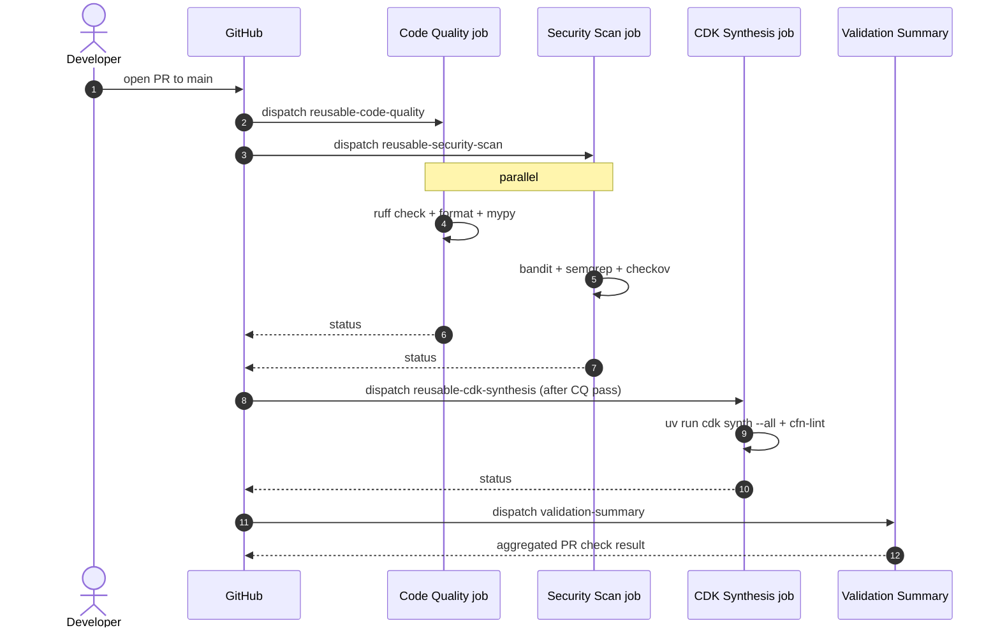
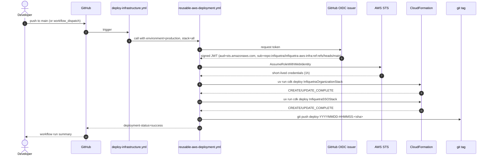

# 04 — CI/CD Pipeline

How code goes from a commit on your laptop to deployed AWS infrastructure.

## Visual: pipeline architecture


## Two main workflows

| Workflow file | Trigger | What it does |
|---|---|---|
| `pull-request-validation.yml` | `pull_request` to `main`, or `workflow_dispatch` | Runs code quality + security + CDK synth checks. **No AWS write access.** |
| `deploy-infrastructure.yml` | `push` to `main`, or `workflow_dispatch` | Deploys both CDK stacks via OIDC. |

Both call into reusable workflows for the actual work; they themselves are thin orchestrators.

## Reusable workflows

| File | Job(s) | Inputs |
|---|---|---|
| `reusable-code-quality.yml` | ruff (lint + format check), mypy | `python-version` |
| `reusable-security-scan.yml` | bandit, semgrep, checkov on synthesized templates | `python-version`, `upload-sarif` |
| `reusable-cdk-synthesis.yml` | `uv run cdk synth --all`, cfn-lint, cost estimation | `python-version`, `node-version`, `cdk-account`, `cdk-region` |
| `reusable-aws-deployment.yml` | `uv run cdk deploy InfiquetraOrganizationStack` then `InfiquetraSSOStack`, then git tag push | `environment`, `stack`, `aws-account`, `aws-region`, `require-approval`, `python-version`, `node-version` (+ `aws-role-arn` secret) |

## Composite actions

Setup steps factored out so they're shared across workflows.

| Action | Purpose | Inputs |
|---|---|---|
| `setup-python-uv` | Install Python 3.13, uv, run `uv sync --dev`, cache pip deps | `python-version` |
| `setup-node-cdk` | Install Node.js + AWS CDK CLI globally | `node-version` |
| `setup-aws-credentials` | OIDC `AssumeRoleWithWebIdentity` against the GHA role | `aws-role-arn`, `aws-region`, `session-name-prefix` |

## The PR validation flow (read-only)



**No AWS credentials needed** — `cdk synth` doesn't talk to AWS. PR validation runs in a sandboxed runner with `contents: read` token and no IAM elevation.

## The foundation deploy flow (with management-account AWS write access)



This flow is for the foundation repository only. It deploys management-account infrastructure such as Organizations, Identity Center, and the management GitHub OIDC role. The workflow `environment` input is a deployment label; all foundation stacks deploy from the management account `645166163764`. CAMPPS service repositories use separate workload-account deploy roles.

### Permissions on the deploy workflow

```yaml
# .github/workflows/deploy-infrastructure.yml
permissions:
  contents: read   # baseline for the post-deployment job

jobs:
  deploy:
    permissions:
      id-token: write   # for OIDC token request
      contents: write   # for git tag push
```

The reusable workflow declares the same permissions on its job too, but those declarations are aspirational — the **caller's token caps** what the callee can do. See [LEARNINGS](../engineering-journal/LEARNINGS.md) entry on reusable workflow permissions.

## Workflow inputs (manual deploy)

You can trigger a manual deploy via `workflow_dispatch`:

```bash
gh workflow run "Deploy Infrastructure" \
  --repo infiquetra/infiquetra-aws-infra \
  --ref main \
  -f environment=production \
  -f stack=all
```

| Input | Default | Options |
|---|---|---|
| `environment` | `production` | `production`, `nonprod`, `staging` |
| `stack` | `all` | `all`, `organization`, `sso` |

**Note**: For this foundation repository, `production`, `nonprod`, and `staging` are workflow deployment labels only. The Organizations, Identity Center, and foundation bootstrap stacks still deploy from the management account `645166163764`; workload-account deployments belong in CAMPPS service repositories.

## CAMPPS service repository release flow

Each CAMPPS service repository should own its own workflow and service CDK app. The foundation repo only bootstraps the workload deploy roles those service repos assume.

| Stage | AWS access | Target | Trigger |
|---|---|---|---|
| PR validation | None, or read-only validation later | No deployment | Pull request checks: tests, lint, synth, security, policy validation |
| Nonprod deploy | `campps-<service>-nonprod-gha-deploy-role` | `campps-nonprod` (`477152411873`) | Automatic deploy from merges to `main`, or manual dispatch using GitHub environment `nonprod` |
| Staging deploy | `campps-<service>-staging-gha-deploy-role` after staging account ID is available | `campps-staging` (pending deployment) | Manual dispatch or scheduled release using GitHub environment `staging` |
| Production deploy | `campps-<service>-production-gha-deploy-role` | `campps-prod` (`431643435299`) | Manual deploy with approval using protected GitHub environment `production` and production release tags |
| Local nonprod deploy | SSO `CAMPPSDeveloper` target profile | `campps-nonprod` | Developer debugging and fast iteration |
| Local staging deploy | SSO `CAMPPSDeveloper` target profile after account creation | `campps-staging` | Release rehearsal and staging debugging |
| Local production deploy | SSO break-glass target profile | `campps-prod` | Emergency only, documented after use |

The workload OIDC trust policy uses `repo:infiquetra/<service-repo>:environment:<nonprod|staging|production>`, so service workflows must set the matching GitHub environment before calling `aws-actions/configure-aws-credentials`. Do not point service repositories at `infiquetra-aws-infra-gha-role`; that role is intentionally scoped to this foundation repo.

Service repos should keep application IAM roles under `campps-<service>-<environment>-app-*` and create them with the per-service permissions boundary `campps-<service>-<environment>-permissions-boundary`. That boundary is part of the deploy-role bootstrap and is what lets service CDK stacks create app roles without letting them mutate the deploy identity.

### CAMPPS deploy-role bootstrap preflight

Do not deploy these stacks casually. They create write-capable deploy identities in the workload accounts. Run the read-only checks first, review the synthesized IAM, then deploy nonprod before staging, and staging before production. The staging deploy-role stack becomes deployable only after the staging account ID is available.

1. Confirm the service registry contains only repos that should receive AWS write access:

   ```bash
   uv run python - <<'PY'
   from infiquetra_aws_infra.campps_service_registry import CAMPPS_SERVICE_REPOSITORIES

   for service in CAMPPS_SERVICE_REPOSITORIES:
       print(service.name, service.repository, service.environments)
   PY
   ```

2. Confirm the target GitHub repository has matching environments:

   ```bash
   for repo in campps-platform campps-contracts campps-identity-access; do
     echo "$repo"
     gh api "repos/infiquetra/${repo}/environments" \
       --jq '.environments[].name'
   done
   ```

   Expected before relying on OIDC deploys: `nonprod`, `staging`, and `production` exist. Staging should be manual or scheduled; production should require manual approval.

3. Confirm existing workload accounts are CDK bootstrapped in `us-east-1`; add the staging account check after CDK account creation completes:

   ```bash
   aws cloudformation describe-stacks \
     --stack-name CDKToolkit \
     --profile campps-nonprod --region us-east-1 \
     --query 'Stacks[0].StackStatus'

   aws cloudformation describe-stacks \
     --stack-name CDKToolkit \
     --profile campps-prod-readonly --region us-east-1 \
     --query 'Stacks[0].StackStatus'
   ```

   If either existing stack is missing, bootstrap that account explicitly before deploying service roles. Do not deploy a staging deploy-role stack until the `campps-staging` account ID exists and its `CDKToolkit` stack is confirmed.

4. Synthesize and review the workload deploy-role target:

   ```bash
   uv run cdk -a "python app_campps_bootstrap.py" synth --quiet
   ```

   Review `cdk.out/CamppsNonProdDeployRolesStack.template.json`, the staging template after the staging account ID is configured, and `cdk.out/CamppsProductionDeployRolesStack.template.json` before deployment. Confirm there are no permissions for Organizations, SSO Admin, SSO, or IdentityStore.

5. Deploy nonprod first after explicit approval:

   ```bash
   uv run cdk -a "python app_campps_bootstrap.py" deploy \
     CamppsNonProdDeployRolesStack \
     --profile campps-nonprod --region us-east-1
   ```

6. Test one service repository nonprod deploy through GitHub Actions using environment `nonprod`.

7. After the staging account ID is available and bootstrapped, deploy the staging deploy-role stack and test one service repository through GitHub Actions using environment `staging`.

8. Deploy production only after the nonprod and staging paths are proven and the production GitHub environment has manual approval configured:

   ```bash
   uv run cdk -a "python app_campps_bootstrap.py" deploy \
     CamppsProductionDeployRolesStack \
     --profile campps-prod-breakglass --region us-east-1
   ```

9. After each stack deploys, store the resulting role ARN as a GitHub environment secret in the service repo. Use separate secrets for nonprod, staging, and production.

### SSO group-assignment preflight

The CDK target defines optional group assignments, but the parameters are intentionally empty by default. Do not remove legacy direct `AdministratorAccess` assignments until every replacement profile has been tested.

1. Confirm or create the Identity Center groups:
   - `InfiquetraAdmins`
   - `CAMPPSDevelopers`
   - `CAMPPSProdReadOnly`
   - `CAMPPSProdBreakGlassAdmins`

2. Resolve their Identity Store group IDs:

   ```bash
   aws identitystore list-groups \
     --identity-store-id d-90676975b4 \
     --profile infiquetra-root \
     --query 'Groups[].{DisplayName:DisplayName,GroupId:GroupId}' \
     --output table
   ```

3. Synthesize the SSO stack with parameter overrides and inspect the resulting account assignments.

4. Deploy the SSO stack only after the group IDs are verified by copy/paste, not guessed.

5. Test replacement profiles in this order:
   1. management admin
   2. `campps-nonprod` developer
   3. `campps-prod-readonly`
   4. `campps-prod-breakglass`

6. Remove legacy direct `AdministratorAccess` assignments only after all replacement profiles work.

## Branch and merge protection

Currently configured on `main`:

| Setting | State |
|---|---|
| Required reviews | 0 |
| Required status checks | All four PR validation jobs (code-quality, security-scan, cdk-synthesis, validation-summary) |
| Allow squash merge | Yes (preferred) |
| Allow merge commits | Yes |
| Allow rebase merge | Yes |
| Auto-delete head branches | Yes |

To configure manually: GitHub → Settings → Rules → Rulesets → main protection.

## Where the deploy logs live

| What | Where |
|---|---|
| Workflow run logs | https://github.com/infiquetra/infiquetra-aws-infra/actions |
| CFN events for failed deploys | `aws cloudformation describe-stack-events --stack-name InfiquetraOrganizationStack` |
| Deployment tags (one per successful deploy) | `git tag --list 'deploy-*' --sort=-creatordate` |

## How to debug a failed deploy

```bash
# 1. Find the failing run
gh run list --repo infiquetra/infiquetra-aws-infra \
  --workflow="Deploy Infrastructure" --limit 5

# 2. Pull failed-step logs
gh run view <RUN_ID> --repo infiquetra/infiquetra-aws-infra --log-failed

# 3. If the failure is at the CDK step, also check CFN events directly
aws cloudformation describe-stack-events \
  --stack-name InfiquetraOrganizationStack \
  --profile infiquetra-root --region us-east-1 \
  --query 'StackEvents[?ResourceStatus!=`CREATE_COMPLETE`].{T:Timestamp,R:LogicalResourceId,S:ResourceStatus,Reason:ResourceStatusReason}' \
  --output table

# 4. If a stack is stuck in ROLLBACK_COMPLETE, delete and retry
aws cloudformation delete-stack \
  --stack-name InfiquetraOrganizationStack \
  --profile infiquetra-root --region us-east-1
aws cloudformation wait stack-delete-complete \
  --stack-name InfiquetraOrganizationStack \
  --profile infiquetra-root --region us-east-1
gh workflow run "Deploy Infrastructure" \
  --repo infiquetra/infiquetra-aws-infra \
  -f environment=production -f stack=all
```

The full stabilization saga from PR #3 to PR #8 is documented in [`../engineering-journal/ARCHIVE.md`](../engineering-journal/ARCHIVE.md) — useful priors when debugging similar future issues.

## Local pipeline testing with `act`

`.actrc` is committed at repo root. To run the PR validation pipeline locally before pushing:

```bash
# Install act
brew install act

# Run the PR validation workflow
act pull_request -W .github/workflows/pull-request-validation.yml

# Run a specific job
act -j code-quality -W .github/workflows/pull-request-validation.yml
```

This uses Docker to emulate GitHub Actions runners. Useful for catching workflow-level errors before push.
