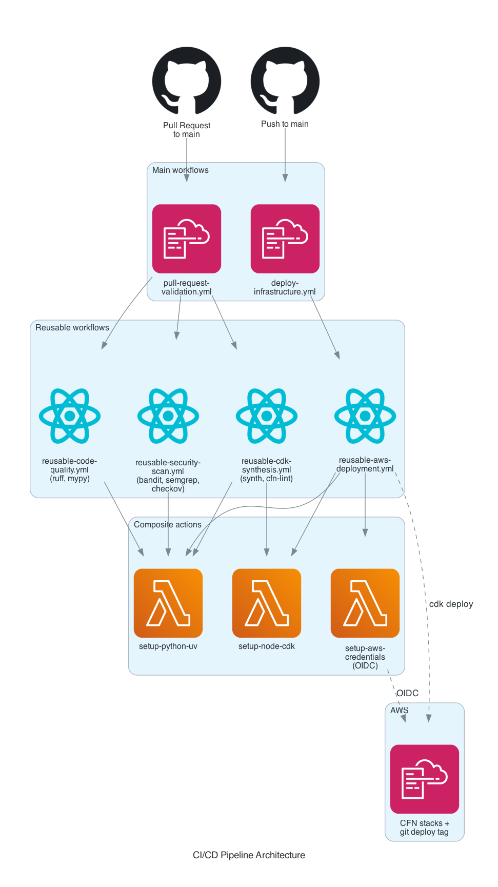
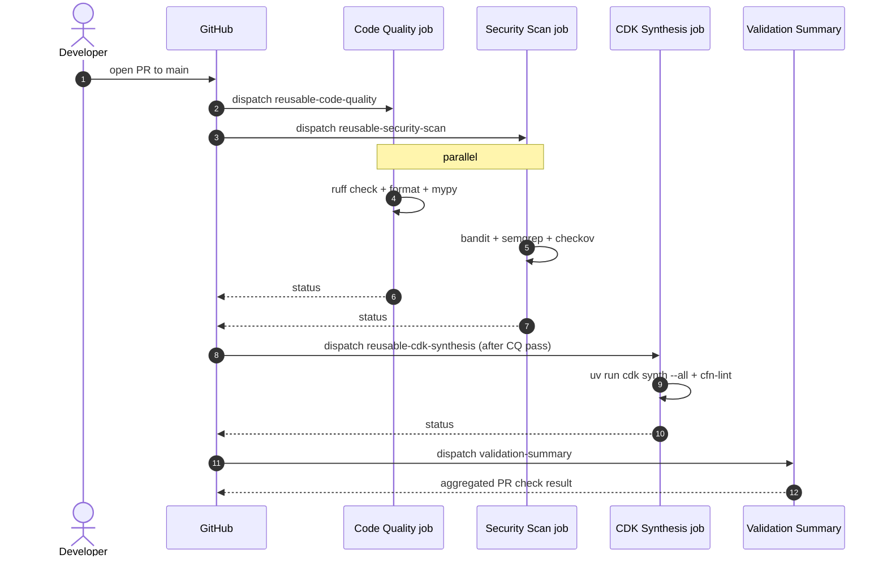
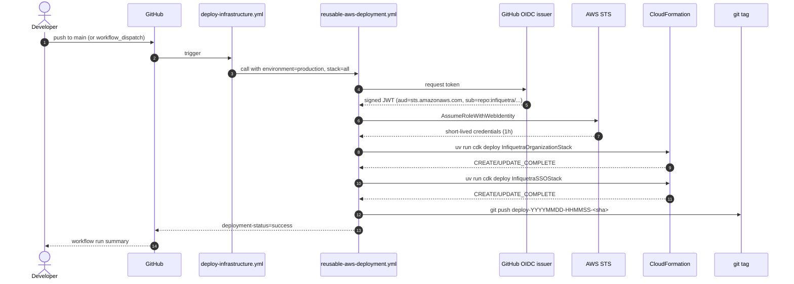

# 04 — CI/CD Pipeline

How code goes from a commit on your laptop to deployed AWS infrastructure.

## Visual: pipeline architecture



## Two main workflows

| Workflow file | Trigger | What it does |
|---|---|---|
| `pull-request-validation.yml` | `pull_request` to `main`, or `workflow_dispatch` | Runs code quality + security + CDK synth checks. **No AWS write access.** |
| `deploy-infrastructure.yml` | `push` to `main`, or `workflow_dispatch` | Deploys both CDK stacks via OIDC. |

Both call into reusable workflows for the actual work; they themselves are thin orchestrators.

## Reusable workflows

| File | Job(s) | Inputs |
|---|---|---|
| `reusable-code-quality.yml` | ruff (lint + format check), mypy | `python-version` |
| `reusable-security-scan.yml` | bandit, semgrep, checkov on synthesized templates | `python-version`, `upload-sarif` |
| `reusable-cdk-synthesis.yml` | `uv run cdk synth --all`, cfn-lint, cost estimation | `python-version`, `node-version`, `cdk-account`, `cdk-region` |
| `reusable-aws-deployment.yml` | `uv run cdk deploy InfiquetraOrganizationStack` then `InfiquetraSSOStack`, then git tag push | `environment`, `stack`, `aws-account`, `aws-region`, `require-approval`, `python-version`, `node-version` (+ `aws-role-arn` secret) |

## Composite actions

Setup steps factored out so they're shared across workflows.

| Action | Purpose | Inputs |
|---|---|---|
| `setup-python-uv` | Install Python 3.13, uv, run `uv sync --dev`, cache pip deps | `python-version` |
| `setup-node-cdk` | Install Node.js + AWS CDK CLI globally | `node-version` |
| `setup-aws-credentials` | OIDC `AssumeRoleWithWebIdentity` against the GHA role | `aws-role-arn`, `aws-region`, `session-name-prefix` |

## The PR validation flow (read-only)



**No AWS credentials needed** — `cdk synth` doesn't talk to AWS. PR validation runs in a sandboxed runner with `contents: read` token and no IAM elevation.

## The deploy flow (with AWS write access)



### Permissions on the deploy workflow

```yaml
# .github/workflows/deploy-infrastructure.yml
permissions:
  contents: read   # baseline for the post-deployment job

jobs:
  deploy:
    permissions:
      id-token: write   # for OIDC token request
      contents: write   # for git tag push
```

The reusable workflow declares the same permissions on its job too, but those declarations are aspirational — the **caller's token caps** what the callee can do. See [LEARNINGS](../engineering-journal/LEARNINGS.md) entry on reusable workflow permissions.

## Workflow inputs (manual deploy)

You can trigger a manual deploy via `workflow_dispatch`:

```bash
gh workflow run "Deploy Infrastructure" \
  --repo infiquetra/infiquetra-aws-infra \
  --ref main \
  -f environment=production \
  -f stack=all
```

| Input | Default | Options |
|---|---|---|
| `environment` | `production` | `production`, `nonprod`, `staging` |
| `stack` | `all` | `all`, `organization`, `sso` |

**Note**: `nonprod` and `staging` map to `aws-account=TBD-NONPROD-ACCOUNT` placeholder — they don't deploy anywhere real yet. Auto-deploy on push always uses `production`.

## Branch and merge protection

Currently configured on `main`:

| Setting | State |
|---|---|
| Required reviews | 1 (admin can bypass with `--admin` on `gh pr merge`) |
| Required status checks | All four PR validation jobs (code-quality, security-scan, cdk-synthesis, validation-summary) |
| Allow squash merge | Yes (preferred) |
| Allow merge commits | Yes |
| Allow rebase merge | Yes |
| Auto-delete head branches | Yes |

To configure manually: GitHub → Settings → Rules → Rulesets → main protection.

## Where the deploy logs live

| What | Where |
|---|---|
| Workflow run logs | https://github.com/infiquetra/infiquetra-aws-infra/actions |
| CFN events for failed deploys | `aws cloudformation describe-stack-events --stack-name InfiquetraOrganizationStack` |
| Deployment tags (one per successful deploy) | `git tag --list 'deploy-*' --sort=-creatordate` |

## How to debug a failed deploy

```bash
# 1. Find the failing run
gh run list --repo infiquetra/infiquetra-aws-infra \
  --workflow="Deploy Infrastructure" --limit 5

# 2. Pull failed-step logs
gh run view <RUN_ID> --repo infiquetra/infiquetra-aws-infra --log-failed

# 3. If the failure is at the CDK step, also check CFN events directly
aws cloudformation describe-stack-events \
  --stack-name InfiquetraOrganizationStack \
  --profile infiquetra-root --region us-east-1 \
  --query 'StackEvents[?ResourceStatus!=`CREATE_COMPLETE`].{T:Timestamp,R:LogicalResourceId,S:ResourceStatus,Reason:ResourceStatusReason}' \
  --output table

# 4. If a stack is stuck in ROLLBACK_COMPLETE, delete and retry
aws cloudformation delete-stack \
  --stack-name InfiquetraOrganizationStack \
  --profile infiquetra-root --region us-east-1
aws cloudformation wait stack-delete-complete \
  --stack-name InfiquetraOrganizationStack \
  --profile infiquetra-root --region us-east-1
gh workflow run "Deploy Infrastructure" \
  --repo infiquetra/infiquetra-aws-infra \
  -f environment=production -f stack=all
```

The full stabilization saga from PR #3 to PR #8 is documented in [`../engineering-journal/ARCHIVE.md`](../engineering-journal/ARCHIVE.md) — useful priors when debugging similar future issues.

## Local pipeline testing with `act`

`.actrc` is committed at repo root. To run the PR validation pipeline locally before pushing:

```bash
# Install act
brew install act

# Run the PR validation workflow
act pull_request -W .github/workflows/pull-request-validation.yml

# Run a specific job
act -j code-quality -W .github/workflows/pull-request-validation.yml
```

This uses Docker to emulate GitHub Actions runners. Useful for catching workflow-level errors before push.
