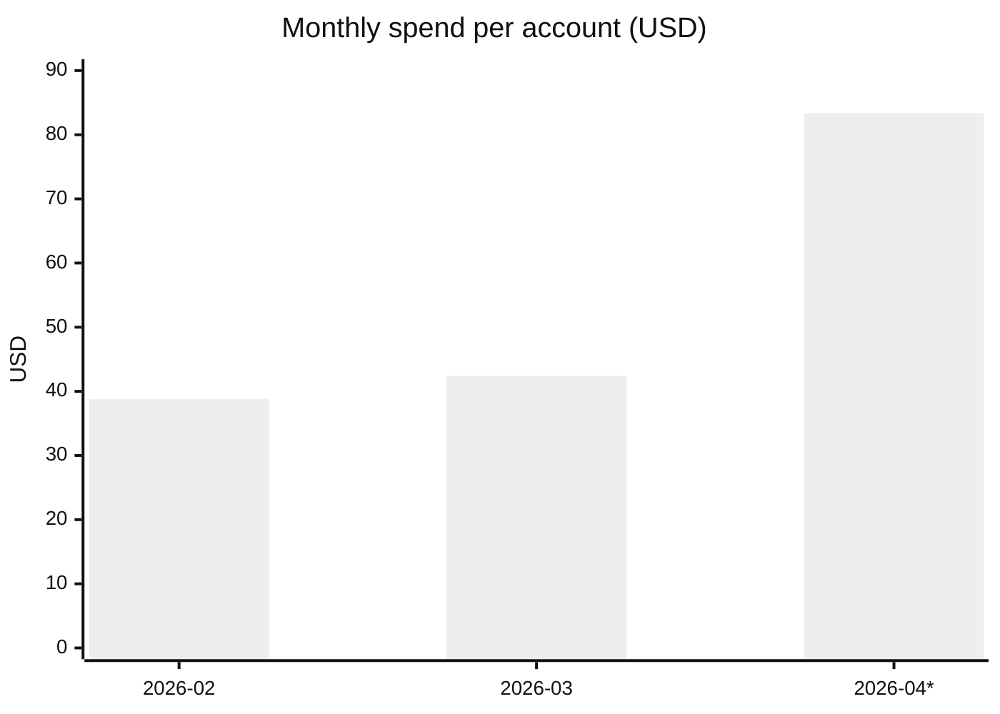

# 06 — Cost

What you're actually spending, what every service costs, what to expect as workloads grow.

## TL;DR

- **Last 90 days total**: ~**$173** across the org
- **Last 30 days**: **$84** (with a one-time $47 domain registration spike)
- **Steady-state monthly run-rate**: ~**$36–43/mo** (excluding occasional domain renewals and one-off purchases)
- **Top spend category by far**: **AWS Directory Service** (a Microsoft AD instance, ~$31–37/mo)
- **All spend is on the mgmt account `645166163764`** except `$0.51/mo` recurring on `campps-prod`
- **None of this spend is created by the CDK in this repo.** This repo deploys Organizations + SSO + IAM, all of which are free. Costs are pre-existing infrastructure on the mgmt account.

## Live spend — last 90 days

Pulled from AWS Cost Explorer on 2026-04-27. Period: 2026-01-27 through 2026-04-27.

### By month, per account

| Month | infiquetra (mgmt) | campps-prod | campps-dev | Total |
|---|---:|---:|---:|---:|
| 2026-01 (partial, last 5d) | $6.55 | $0.00 | $0.00 | $6.55 |
| 2026-02 | $38.80 | $0.51 | $0.00 | $39.31 |
| 2026-03 | $42.43 | $0.51 | $0.00 | $42.94 |
| 2026-04 (1–27) | $83.37 | $0.51 | $0.00 | $83.88 |
| **90-day total** | **$171.15** | **$1.53** | **$0.00** | **$172.68** |

### By month, per service (mgmt account)

| Service | Feb 2026 | Mar 2026 | Apr 2026 (partial) |
|---|---:|---:|---:|
| AWS Directory Service | $33.61 | $37.24 | $31.04 |
| Amazon Registrar | $0 | $0 | **$47.00** ← one-time domain renewal |
| Amazon Route 53 | $3.05 | $3.04 | $3.54 |
| Amazon EFS | $1.54 | $1.54 | $1.34 |
| AWS KMS | $0.99 | $0.99 | $0.86 |
| Amazon S3 | $0.12 | $0.12 | (small) |
| AWS Secrets Manager | (small) | (small) | $0.86 |
| **Total** | **$39.31** | **$42.94** | **$83.88** |

### Spend per account per month, visualized



(* April is partial through 2026-04-27, including the one-time $47 registrar renewal.)

## What each running service is

The recurring spend is mostly **infrastructure that pre-dates this repo**:

| Service | What it is | Created by | Why kept |
|---|---|---|---|
| AWS Directory Service | A Microsoft AD or Simple AD instance — usage shows ~$1.05/day, consistent with AWS Managed Microsoft AD Standard Edition | Pre-existing manual setup | _Verify in console — possibly leftover from earlier project_ |
| Amazon Route 53 | DNS hosted zones (~$0.50/zone/month) — current run rate suggests ~6 zones | Pre-existing | Domain DNS for owned domains |
| Amazon EFS | An EFS file system with low usage (~50 GB stored equiv) | Pre-existing | _Verify in console_ |
| Amazon Registrar | Domain name registration (~$15-50/yr per `.com`/`.org` etc.) | Pre-existing | The domains backing your business |
| AWS KMS | Customer-managed KMS keys ($1/key/month + per-request) | Pre-existing | _Identify which keys; some may be auto-created by other services_ |
| AWS Secrets Manager | Stored secrets ($0.40/secret/month + API calls) | Pre-existing | _Identify which secrets are stored_ |
| Amazon S3 | Small object storage (~$0.12/month implies ~5 GB Standard) | Pre-existing | _Identify the bucket(s)_ |

`★ Action item:` The single biggest line item (Directory Service, ~$36/mo = $432/yr) is worth reviewing. If the AD instance is unused, deleting it cuts your monthly run rate by ~85%. If it's actively used, document what depends on it.

## What this repo's CDK costs to run

**Zero recurring AWS costs** for the resources deployed by this repo:

| CDK-deployed resource | AWS cost |
|---|---|
| AWS Organizations (root, OUs) | Free |
| Service Control Policies | Free |
| IAM Identity Center | Free (up to 50,000 users) |
| Permission sets | Free |
| Identity Store (users, groups) | Free |
| OIDC provider in IAM | Free |
| IAM roles + managed policies | Free |
| Lambda function for OIDC custom resource | Free at this scale (only invoked on stack changes) |
| GitHub Actions OIDC federation | Free (no AWS-side cost) |

**The CI/CD pipeline itself** runs on GitHub-hosted runners. GitHub Actions pricing applies (free tier: 2,000 minutes/month for private repos, unlimited for public repos). Public repos on github.com get unlimited minutes.

## Pricing model — what new things would cost

Reference for planning. AWS pricing as of 2026-04-27 (us-east-1).

### Compute — when you start running workloads

| Service | Free tier | Beyond free tier |
|---|---|---|
| Lambda | 1M requests + 400k GB-sec/month free | $0.20 / 1M requests + $0.0000167/GB-sec |
| ECS on Fargate | None | ~$0.04/vCPU-hr + $0.004/GB-hr (Linux) |
| EC2 t4g.micro | 750h/month free for 12 months | $0.0084/hr → ~$6/mo |
| EC2 t3.medium | None | $0.0416/hr → ~$30/mo |

### Storage

| Service | Free tier | Beyond |
|---|---|---|
| S3 Standard | 5 GB free for 12 months | $0.023/GB-month |
| EFS Standard | None | $0.30/GB-month |
| DynamoDB on-demand | 25 GB + 200M req free for 12 mo | $0.25/GB + $1.25/M write + $0.25/M read |
| RDS db.t4g.micro | 750h + 20 GB free for 12 mo | $0.016/hr → ~$12/mo + storage |

### Networking

| Service | Cost |
|---|---|
| Data transfer OUT to internet | First 100 GB/mo free, then $0.09/GB |
| Data transfer between AZs | $0.01/GB per direction |
| NAT Gateway | $0.045/hr ($32/mo) + $0.045/GB processed |
| Application Load Balancer | $0.0225/hr ($16/mo) + LCU charges |
| Route 53 hosted zone | $0.50/zone/month |
| Route 53 query | $0.40 per million queries |

### Security & monitoring (the things you'll actually want enabled)

| Service | Cost |
|---|---|
| AWS Config | $0.003 per config item recorded + $0.001 per rule eval |
| CloudTrail (mgmt events) | First trail free; second trail $2/100k events |
| CloudTrail (data events) | $0.10 per 100k events |
| GuardDuty | First 30 days free, then varies by data source (~$3-15/mo for small orgs) |
| Security Hub | $0.0010 per security check ($30/mo per account at typical volume) |
| AWS Budgets | First 2 budgets free, then $0.02/budget/day |
| AWS Backup | Storage at backed-up service rate; backup itself is free |
| Cost Explorer | Free for the API's first 1,000 requests/month, then $0.01/req |

### Common "ouch" items

| Risk | Cost if you forget |
|---|---|
| Unattached EBS volumes | $0.10/GB/month (a 100 GB volume left running = $10/mo) |
| Idle NAT Gateway | $32/mo just for existing |
| Forgotten EC2 instance | Whatever the instance type costs * 730h/mo |
| CloudWatch Logs (default retention forever) | $0.50/GB ingested + $0.03/GB-month stored |
| RDS unused for years | Backup snapshots accrue at $0.095/GB/month |

**Rule of thumb**: $50/mo is "I'm running a few small things." $500/mo is "I have a real production workload." $5,000/mo+ is "I have an actual business and probably need a Reserved Instance / Savings Plan strategy."

## Projections — what the next 6 months might look like

Three scenarios based on what you choose to build.

### Scenario A: Continue as-is (no new workloads)

Steady state: ~**$36/mo** (drop to ~$20-25/mo if you decommission the unused Directory Service).

| | $/mo |
|---|---:|
| Directory Service (current) | $35 |
| Route 53 | $3 |
| EFS | $1.50 |
| KMS | $1 |
| Misc (S3, Secrets) | $1 |
| **Total** | **~$42** |

### Scenario B: Add a small serverless app (Lambda + DynamoDB + API Gateway)

| | $/mo |
|---|---:|
| Existing baseline | $36 |
| Lambda (10M requests, 100ms avg) | $2 |
| DynamoDB on-demand (1 GB, 5M reads + 1M writes) | $5 |
| API Gateway HTTP API (10M req) | $10 |
| CloudWatch Logs (5 GB ingested, 30-day retention) | $3 |
| **Total** | **~$56** |

### Scenario C: Production app with VPC + ECS Fargate + RDS

| | $/mo |
|---|---:|
| Existing baseline | $36 |
| 2x NAT Gateway (multi-AZ) | $64 + data transfer |
| ECS Fargate (2 tasks, 0.5 vCPU + 1 GB, 24/7) | $30 |
| RDS db.t4g.small (Multi-AZ) | $50 |
| Application Load Balancer | $16 |
| Route 53 health checks | $5 |
| GuardDuty + Security Hub | $40 |
| AWS Config | $20 |
| CloudWatch Logs + Metrics | $20 |
| Data transfer out (100 GB) | $9 |
| **Total** | **~$290** |

The jump from B to C is mostly **NAT Gateway, RDS, ALB, and managed security services**. None are optional for production.

## Where to look for cost surprises

```bash
# Last 7 days, top 10 services
START=$(date -u -v-7d +%Y-%m-%d)
END=$(date -u +%Y-%m-%d)
aws ce get-cost-and-usage --time-period Start=$START,End=$END \
  --granularity DAILY --metrics UnblendedCost \
  --group-by Type=DIMENSION,Key=SERVICE \
  --profile infiquetra-root --region us-east-1 \
  | jq -r '.ResultsByTime[].Groups | sort_by(.Metrics.UnblendedCost.Amount) | reverse | .[0:10] | .[] | "\(.Keys[0]): $\(.Metrics.UnblendedCost.Amount)"'

# Anomaly: check for sudden spikes
aws ce get-anomalies --date-interval StartDate=$(date -u -v-30d +%Y-%m-%d),EndDate=$(date -u +%Y-%m-%d) \
  --profile infiquetra-root --region us-east-1 2>/dev/null | jq '.Anomalies[]'
```

## Setting up alerts

You don't have any cost alerts configured today. Recommended:

```bash
# A simple monthly budget alert at $100
aws budgets create-budget \
  --account-id 645166163764 \
  --budget '{"BudgetName":"monthly-100","BudgetLimit":{"Amount":"100","Unit":"USD"},"TimeUnit":"MONTHLY","BudgetType":"COST"}' \
  --notifications-with-subscribers '[{"Notification":{"NotificationType":"ACTUAL","ComparisonOperator":"GREATER_THAN","Threshold":80,"ThresholdType":"PERCENTAGE"},"Subscribers":[{"SubscriptionType":"EMAIL","Address":"jeff@infiquetra.com"}]}]' \
  --profile infiquetra-root
```

Or via console: AWS Budgets → Create → Cost budget → set monthly limit + 80% / 100% / 120% email alerts.

First 2 budgets are free; subsequent ones are $0.02/day.

## Cost section — the takeaway

You're not "spending too much" — your run rate is in the 'small project' range. The only thing worth investigating: **what's running in AWS Directory Service**, since that's 80% of your steady-state spend. If unused, kill it.

Beyond that, the cost story doesn't drive any urgency to stop "getting set up" — the **friction is decision fatigue, not budget**. See [07-whats-next.md](07-whats-next.md).
