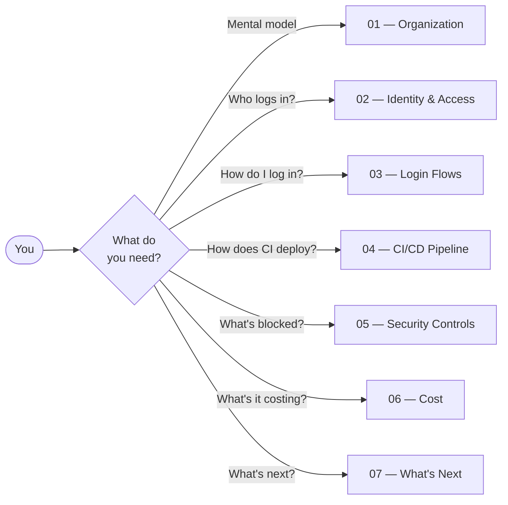

# Operations Documentation

You are the owner/operator. This is the comprehensive snapshot of **what currently exists in AWS**, **what CDK manages**, **who logs in**, **how**, **what it costs**, and **what to focus on next**.

> Audience: The operator (you) — assumes AWS / CDK familiarity. For newcomer-friendly walkthroughs, see [`../onboarding/`](../onboarding/).
>
> Snapshot date: **2026-04-27**. The "live" data in these pages was pulled directly from AWS APIs (Organizations, Identity Center, IAM, Cost Explorer) on the date above. Re-pull any time the AWS state diverges materially from what's documented.

## You are here



## Sections

| # | Section | What's in it |
|---|---|---|
| 01 | [AWS Organization](01-aws-organization.md) | The full account + OU tree (with the dual-CAMPPS situation explained), what CDK creates vs. what was pre-existing, the management account |
| 02 | [Identity & Access](02-identity-and-access.md) | All 13 SSO permission sets (legacy + CDK-managed), who's assigned what, the GitHub OIDC role, IAM trust chains |
| 03 | [Login Flows](03-login-flows.md) | Step-by-step flows for developer SSO login, CI/CD OIDC federation, MFA, session lifecycle |
| 04 | [CI/CD Pipeline](04-ci-cd-pipeline.md) | Composite actions + reusable workflows, the deploy chain, branch protection, what runs where |
| 05 | [Security Controls](05-security-controls.md) | Service Control Policies (with the gap that legacy CAMPPS isn't covered), MFA enforcement, what's actually blocked |
| 06 | [Cost](06-cost.md) | Last 30/90 days actual spend, per-service pricing model, projections as workloads grow |
| 07 | [What's Next](07-whats-next.md) | The minimum forward path: stop "getting set up", start building. Cross-references [`../learnings/QUEUED.md`](../learnings/QUEUED.md). |

## At a glance

| | |
|---|---|
| **AWS Organization** | `r-f3un` in account `645166163764` (infiquetra) |
| **Active accounts** | `infiquetra` (mgmt), `campps-prod`, `campps-dev` |
| **OUs** | 13 total (5 CDK-managed empty + 8 legacy with the workload accounts) |
| **SCPs** | 2 customer-managed (BaseSecurityPolicy, NonProductionCostControl) |
| **Identity Center users** | 1 (`jefcox`) + 1 group (`Administrators`, currently empty) |
| **SSO permission sets** | 13 (2 legacy + 11 CDK-managed) |
| **GitHub OIDC role** | `infiquetra-aws-infra-gha-role` (trusts `repo:infiquetra/*`) |
| **CFN stacks deployed** | 3 (Organization, SSO, gha-bootstrap) |
| **Last 30 days spend** | $84 (mostly Amazon Registrar + AWS Directory Service) |
| **Last 90 days spend** | $173 |
| **Auto-deploy on push to main** | enabled, OIDC-authenticated |

## Key things to know

`★ Diagram in the docs are PNGs in [diagrams/](diagrams/), regenerable via:`

```bash
uv run python docs/ops/diagrams/generate.py
```

- **Two CAMPPS OUs exist** — one legacy (with the actual accounts), one CDK-created (empty scaffolding). They will reconcile via account migration, not via CDK destroy/recreate. See [01-aws-organization.md](01-aws-organization.md).
- **SCPs only cover the empty CDK-managed OUs.** The legacy CAMPPS tree where the real workloads live has zero SCP coverage. This is a known gap. See [05-security-controls.md](05-security-controls.md).
- **You currently log in via the legacy `AdministratorAccess` permission set** (PT12H), not the CDK-managed `CoreAdministrator` (PT4H). Migration is a P2 backlog item. See [02-identity-and-access.md](02-identity-and-access.md).
- **The CI/CD pipeline is fully working** as of 2026-04-25 — see the [`../learnings/ARCHIVE.md`](../learnings/ARCHIVE.md) for the multi-PR stabilization story.
- **Most of your monthly spend is Amazon Registrar (domain registration) + AWS Directory Service.** Neither is created by this repo's CDK — both predate this repo. See [06-cost.md](06-cost.md).
