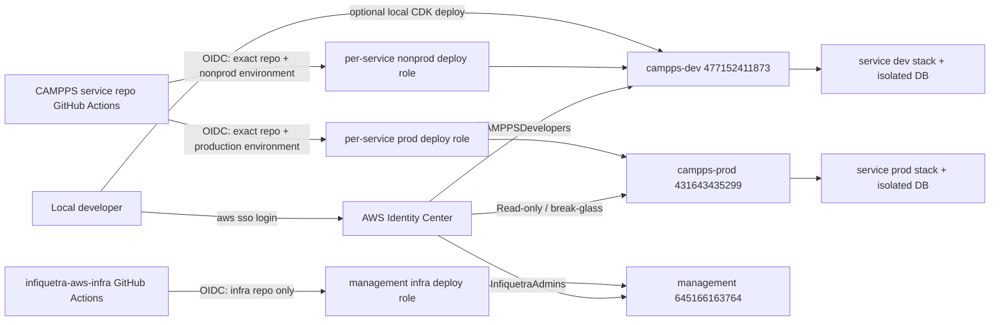

# CAMPPS AWS/CI Foundation Design

## Context

CAMPPS development will start from `../campps-context-library` and move into multiple deployable repositories. Each service or client repository should own its code, IaC, and isolated data stores. The first deployable work is likely a full vertical app slice driven by blueprint context packs.

The AWS organization foundation is already in place: `campps-dev` lives under `Apps/CAMPPS/NonProd`, and `campps-prod` lives under `Apps/CAMPPS/Production`. The remaining risk is access and release flow. Human access still uses direct legacy `AdministratorAccess` assignments, and the current GitHub Actions role in this infrastructure repo has broad management-account permissions and org-wide GitHub trust.

## Decision

Use AWS Identity Center for human access, GitHub OIDC for CI/CD deploys, and registry-generated per-repo deploy roles for CAMPPS service repositories.

Do not reuse the `infiquetra-aws-infra-gha-role` for CAMPPS services. That role is for organization and SSO infrastructure, not workload deployments. It should be tightened to this repository and the required branch or GitHub environment.

## Human AWS access

Daily human access should move away from root-like or legacy direct assignments.

Recommended groups:

| Group | Account | Purpose |
|---|---|---|
| `InfiquetraAdmins` | Management | Organization, SSO, and foundation administration |
| `CAMPPSDevelopers` | `campps-dev` | Development deploys and debugging |
| `CAMPPSProdReadOnly` | `campps-prod` | Production inspection |
| `CAMPPSProdBreakGlassAdmins` | `campps-prod` | Emergency production changes |

Root should be reserved for account recovery only and protected with MFA. Legacy direct assignments should remain until new SSO profiles are tested, then be removed.

## GitHub OIDC access

Each CAMPPS service repo should get deploy roles in workload accounts:

- one nonprod deploy role in `campps-dev`
- one production deploy role in `campps-prod`

The role trust should target the exact GitHub repository and environment, for example:

```text
repo:infiquetra/campps-tenant-setup-service:environment:nonprod
repo:infiquetra/campps-tenant-setup-service:environment:production
```

Do not use `repo:infiquetra/*` for deploy roles that can change AWS resources. Org-wide trust is acceptable only for low-risk read-only validation roles.

To avoid hand-editing IAM for every new repository, define a small service registry and generate the roles from it. A registry entry might look like this:

```yaml
services:
  - name: tenant-setup
    repository: infiquetra/campps-tenant-setup-service
    environments:
      - nonprod
      - production
    deploy_profile: serverless-api
```

The registry is IaC input, not application service discovery. Adding a repo becomes a reviewable config change that creates predictable role names and trust policies.

## Release flow

PR validation should be read-only: linting, tests, CDK synth, security checks, and policy validation should run without AWS write access.

Nonprod deployment should work through GitHub Actions from day one. The `nonprod` GitHub environment can be lightly protected, but it should use an OIDC deploy role in `campps-dev`.

Local SSO deploys to `campps-dev` remain allowed for fast iteration and debugging. Local and CI deploys must target the same CDK app, stack names, account, and region so they converge on the same infrastructure instead of creating parallel stacks.

Production deployment should go through GitHub Actions with a protected `production` environment and manual approval. Local production admin access remains a break-glass path, not the normal release path.

## Non-access foundations

Before the first service reaches production, define:

- stack naming and tag conventions across service repos
- shared configuration discovery for account IDs, region, hosted zones, event buses, and domain names
- Secrets Manager or SSM Parameter Store conventions for external integrations
- baseline structured logging, alarms, DLQs, and dashboards
- data classification, retention, deletion, and backup expectations
- database migration and rollback policy for each service

Release flow is the highest non-access priority because it shapes how service repos handle migrations, approvals, rollback, and production evidence.

## Access diagram



## Implementation sequence

1. Tighten the existing management-account OIDC role to this repository and required branch or environment.
2. Add group-based Identity Center assignments and verify new SSO profiles before removing legacy direct assignments.
3. Add a registry-backed CAMPPS workload deploy-role pattern.
4. Create nonprod and production deploy roles for the first service repo.
5. Add the first service repo workflow: read-only PR validation, nonprod deploy, protected production deploy.
6. Validate local SSO deployment and GitHub nonprod deployment converge on the same `campps-dev` stack.
7. Capture release evidence and rollback notes for the first production deployment.

## Verification

- Root MFA is enabled and root is not used for daily work.
- New SSO group assignments work for management, nonprod, prod read-only, and prod break-glass.
- Legacy direct SSO assignments are removed only after replacement access is confirmed.
- The management OIDC role no longer trusts `repo:infiquetra/*`.
- Unauthorized repos or branches cannot assume the management deploy role.
- The first service repo can deploy to nonprod through GitHub OIDC.
- Local SSO deploys to nonprod target the same stack as CI deploys.
- Production deploys require the protected GitHub `production` environment.

## Open implementation choices

- Should registry-generated deploy roles live in this foundation repo or a dedicated CAMPPS bootstrap repo?
- Should nonprod deploy automatically on merge to `main`, or start as manual workflow dispatch?
- Should production promotion be a release tag, merge to `main`, or manual workflow dispatch?
